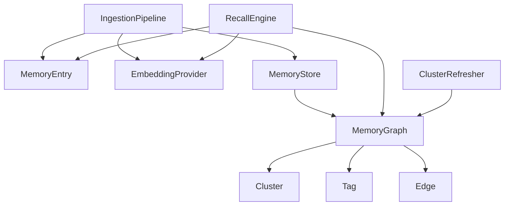

# Fox Agent SDK Memory PRD

## 1. 项目概述

### 1.1 背景

当前 `fox-agent-sdk` 已经具备 Memory 的基础骨架，包括：

- `MemoryEntry` / `MemoryGraph` / `MemoryManager`
- Project / Global 两级存储作用域
- JSON 持久化
- keyword recall
- graph cascade retrieve
- memory prompt 注入
- LLM relevance / extraction 的 trait 抽象

但从 AI Agent 的应用开发角度看，当前 Memory 仍然只是“可持久化的关键词记忆系统”，还不是完整的“语义长期记忆系统”。

核心缺口包括：

- 没有 embedding 生成链路
- 没有 query embedding
- 没有向量检索 / cosine similarity / ANN top-k
- `Semantic` recall 实际回退为 keyword recall
- `Cascade` 不是 semantic + graph 的组合，而是 keyword + graph 的组合
- cluster / centroid 仅有数据结构，缺少真实更新流程
- `auto_extract / verify_relevance / embedding_model_path` 尚未形成完整闭环

因此需要单独对 Memory 模块进行产品化设计，明确其目标、边界、数据模型与实现路线。

### 1.2 目标

- 将当前 Memory 从“关键词 + 图扩展”升级为“语义检索优先的长期记忆系统”
- 支持记忆的写入、去重、验证、嵌入、存储、召回、注入的完整闭环
- 为 Agent 应用提供跨会话、跨任务、跨 worker 的可恢复记忆能力
- 在不强耦合上层 UI / Server 的前提下，提供适合 SDK 使用的基础设施

### 1.3 非目标

- 本阶段不实现分布式向量数据库
- 本阶段不依赖外部 SaaS memory service
- 本阶段不实现复杂知识图谱推理引擎
- 本阶段不构建专用 Memory 管理 UI

### 1.4 成功标准

- `RecallMode::Semantic` 真实使用 embedding 检索
- `RecallMode::Cascade` 真实使用 semantic top-k + graph expansion
- 新写入的 memory 在合理时间内自动生成 embedding 并持久化
- memory 注入优先基于 semantic relevance，而非单纯关键词命中
- 应用可查询、导出、清理、重建 memory 索引

## 2. 用户角色

### 2.1 角色定义

| 角色 | 描述 | 核心诉求 |
|---|---|---|
| Agent 应用开发者 | 使用 SDK 开发 AI Agent 应用的工程师 | 低成本接入长期记忆能力 |
| 产品团队 | 关注 AI Agent 记忆体验的团队 | 跨会话连续性、偏好保留、纠错积累 |
| 安全 / 合规角色 | 关注记忆内容安全边界的人 | 可审计、可删除、可控召回 |
| 测试工程师 | 验证记忆效果与稳定性的人 | 可重放、可重建、可测 |

### 2.2 核心用户故事

1. 作为应用开发者，我希望 Agent 能跨会话记住用户偏好，而不是每次都靠关键词碰运气。
2. 作为产品团队，我希望用户换一种表达方式时，Agent 仍能召回语义相关的记忆。
3. 作为安全负责人，我希望记忆可追踪来源、可删除、可降级、可关闭。
4. 作为测试工程师，我希望 memory 的召回结果可以重建和回归验证。

## 3. 问题定义

### 3.1 当前机制的真实能力

- 记忆条目结构化存储
- 按 Project / Global 作用域持久化为 JSON graph
- 使用 `search_text` 做标准化关键词匹配
- 使用 graph edge 做 cascade 扩展
- 将召回结果拼接为 prompt 注入

### 3.2 当前机制的核心不足

- 无 embedding pipeline
- 无 semantic ranking
- 无 cluster maintenance
- 无 ingestion pipeline（extract -> verify -> dedupe -> embed -> persist）
- 无 background rebuild / re-index
- 无 memory governance（禁用、脱敏、过期、阈值、冲突策略）的系统化设计

## 4. 产品需求

### 4.1 模块一：Memory 数据模型

#### 目标

为长期记忆提供稳定、可版本化、可扩展的数据结构。

#### 功能需求

- `MemoryEntry` 需要包含：
  - id
  - category
  - content
  - tags
  - search_text
  - embedding
  - embedding_model
  - embedding_version
  - confidence
  - trust
  - source
  - created_at / updated_at
  - active
  - superseded_by
  - reinforcements
- `MemoryGraph` 需要包含：
  - memories
  - tags
  - clusters
  - edges
  - metadata
- `GraphMetadata` 需增加：
  - last_embedding_rebuild_at
  - embedding_model
  - embedding_version
  - total_embeddings
  - last_cluster_update

#### 验收标准

- Given 一个新写入的 memory
- When embedding 生成成功
- Then memory 中保存 embedding 向量、模型标识和版本号

### 4.2 模块二：Embedding 生成链路

#### 目标

为 memory 写入和查询提供统一的 embedding 能力。

#### 功能需求

- 定义 `EmbeddingProvider` 抽象
- 至少提供：
  - `embed_text(&str) -> Vec<f32>`
  - `embed_batch(&[String]) -> Vec<Vec<f32>>`
  - `model_name()`
  - `dimension()`
  - `version()`
- 提供默认实现：
  - `NoopEmbeddingProvider`
  - `OnnxEmbeddingProvider` 或等价本地 embedding provider
- `MemoryManager::remember*()` 支持在写入后生成 embedding
- query recall 前支持生成 query embedding
- embedding 失败时允许退化到 keyword 模式，但需记录原因

#### 验收标准

- Given Memory 开启 embedding
- When 写入一条 memory
- Then 对应 memory 自动生成 embedding 并持久化

- Given 用户发起 semantic recall
- When query embedding 生成成功
- Then recall 使用 query embedding 执行向量相似度检索

### 4.3 模块三：Recall 检索链路

#### 目标

构建分层召回策略，使 RecallMode 语义与行为一致。

#### 功能需求

- `RecallMode::Recent`
  - 最近更新优先
- `RecallMode::Keyword`
  - 基于 `search_text`
- `RecallMode::Semantic`
  - 基于 query embedding 与 memory embedding 的相似度排序
- `RecallMode::Cascade`
  - semantic top-k 作为种子
  - 再使用 graph edge 做 BFS/weighted expansion
  - 最终合并重排
- recall 结果需包含：
  - memory entry
  - score
  - score_breakdown
  - retrieval_source

#### 验收标准

- Given 用户使用不同但语义相近的表达
- When 触发 semantic recall
- Then 能命中语义相关 memory

- Given 某条 memory 未关键词命中但语义接近
- When 使用 semantic recall
- Then 该 memory 可以进入 top-k 结果

### 4.4 模块四：Memory Ingestion Pipeline

#### 目标

形成从对话到 memory 的标准化写入流水线。

#### 功能需求

- ingestion 流程：
  - transcript collection
  - extraction
  - dedupe
  - contradiction check
  - confidence assignment
  - embedding generation
  - persistence
- 支持 `auto_extract`
- 支持 `verify_relevance`
- 支持冲突处理策略：
  - ignore
  - supersede
  - downgrade confidence
  - mark contradiction edge

#### 验收标准

- Given 一段对话中出现新的用户偏好
- When auto_extract 开启
- Then SDK 自动抽取并写入 memory

- Given 新信息与旧信息冲突
- When contradiction check 命中
- Then 系统按配置执行 supersede 或 contradiction 标记

### 4.5 模块五：Cluster 与 Graph 增强

#### 目标

让 graph 不仅用于显式链接，也可支撑语义聚合与相关扩展。

#### 功能需求

- cluster 支持 centroid 更新
- 支持 memory 自动归属 cluster
- 支持 tag / cluster / relation 混合 edge
- 支持背景任务更新 cluster
- cascade 时支持 cluster 节点增益

#### 验收标准

- Given 多条内容相近的 memory
- When 执行 cluster refresh
- Then 它们可被归入同一 cluster 并生成 centroid

### 4.6 模块六：Memory 注入策略

#### 目标

提升注入 prompt 的相关性、稳定性与可解释性。

#### 功能需求

- 注入前先做 semantic recall
- 结果按 score、类别、时效、trust 重排
- 控制注入预算：
  - max_results
  - max_chars
  - max_per_category
- 注入结果附带 display_prompt 与原因摘要
- 注入过程输出结构化事件

#### 验收标准

- Given 命中 20 条 memory
- When 注入预算不足
- Then 系统按排序策略截断并保留最有价值的结果

### 4.7 模块七：Memory 治理与运维

#### 目标

让应用方可以管理 memory 生命周期，而不是只能被动使用。

#### 功能需求

- 提供管理能力：
  - search
  - list
  - forget
  - disable / enable
  - re-embed
  - re-index
  - export / import
  - compact
- 提供治理配置：
  - retention_days
  - memory_size_limit
  - embedding_enabled
  - rebuild_on_model_change
- 支持脱敏与删除审计

#### 验收标准

- Given embedding 模型升级
- When 执行 re-embed
- Then 所有 memory 的 embedding 被重建并标记新版本

### 4.8 模块八：测试与回放

#### 目标

确保 memory 效果可测试、可回归、可解释。

#### 功能需求

- 增加 recall regression dataset
- 增加 embedding mock provider
- 增加 transcript replay
- 增加 semantic / keyword / cascade 对比测试
- 增加性能基准：
  - embedding latency
  - recall latency
  - recall accuracy

#### 验收标准

- Given 一组固定 query-memory 数据集
- When 执行 regression
- Then semantic recall 的 top-k 命中率达到目标阈值

## 5. 非功能需求

### 5.1 性能

- 单次 recall 默认在可接受时延内完成
- embedding 支持 batch 计算
- 支持 background rebuild，避免阻塞主 loop

### 5.2 安全

- memory 可按 scope 管控
- 需要支持删除、禁用、审计
- 需要支持敏感信息不进入长期记忆

### 5.3 可用性

- embedding 不可用时要可回退
- recall mode 行为与命名必须一致
- 应用方可清楚理解当前 memory 能力是否开启

### 5.4 可测试性

- 所有 recall 策略要可单测
- embedding provider 要可 mock
- ingestion pipeline 要可重放

## 6. 领域模型

### 6.1 核心领域概念

- `MemoryEntry`：一条长期记忆实体
- `MemoryGraph`：记忆聚合与关系图
- `EmbeddingProvider`：embedding 生成服务
- `RecallEngine`：召回引擎
- `IngestionPipeline`：写入流水线
- `ClusterRefresher`：聚类维护服务
- `MemoryStore`：持久化存储服务

### 6.2 领域模型图

## 7. 开发计划

### 7.1 里程碑

| 里程碑 | 目标 | 交付 |
|---|---|---|
| M1 | 做实 semantic memory 基础 | EmbeddingProvider、embedding 持久化、Semantic recall |
| M2 | 形成 recall 闭环 | Cascade、score breakdown、注入策略升级 |
| M3 | 形成 ingestion 闭环 | auto_extract、dedupe、contradiction、verify |
| M4 | 形成治理与运维能力 | re-embed、re-index、export/import、测试基线 |

### 7.2 任务拆解

| 编号 | 任务 | 预估工作量 |
|---|---|---|
| M-T1 | 设计 EmbeddingProvider trait | 1d |
| M-T2 | 接入默认 embedding provider | 2d |
| M-T3 | 改造 MemoryEntry / GraphMetadata 持久化字段 | 2d |
| M-T4 | 实现 Semantic recall | 2d |
| M-T5 | 实现真正的 Cascade recall | 2d |
| M-T6 | 改造 memory 注入链路使用 semantic recall | 1d |
| M-T7 | 实现 auto_extract + verify + dedupe | 3d |
| M-T8 | 实现 contradiction policy | 2d |
| M-T9 | 实现 cluster refresh | 3d |
| M-T10 | 实现 re-embed / re-index 工具与 API | 2d |
| M-T11 | 增加回归测试与基准测试 | 2d |

## 8. 验收标准

### 8.1 全局验收

- `Semantic` 模式不再退化到 keyword
- `Cascade` 模式以 semantic recall 为种子
- 新增 memory 可自动生成 embedding 并持久化
- memory 注入默认使用语义相关性优先
- 应用可管理 memory 索引与重建

### 8.2 验收用例

#### 用例一：语义召回

- Given memory 中存储了 “用户偏好 Rust 的简洁代码风格”
- When 用户问 “以后写代码尽量保持短小直接”
- Then semantic recall 命中该记忆

#### 用例二：冲突处理

- Given memory 中已有 “用户喜欢 tabs”
- When 新对话抽取到 “用户改为使用 spaces”
- Then 系统能识别冲突并根据策略 supersede 或标记 contradiction

#### 用例三：重建索引

- Given embedding 模型发生升级
- When 执行 re-embed
- Then 所有 active memories 重建 embedding 并更新版本标识

## 9. 风险与约束

- embedding provider 的选择会影响体积、性能与部署复杂度
- 若先做复杂聚类而 recall 基础未稳定，会放大维护成本
- 若 recall mode 语义与行为不一致，会误导应用开发者
- 若 ingestion 无去重与冲突策略，memory 会快速污染

## 10. 当前 codebase 对应的功能实现清单

### 10.1 必须补齐

- 实现 `EmbeddingProvider` 抽象与默认实现
- 在 `MemoryManager::remember_*` 路径中生成并持久化 embedding
- 在 `MemoryManager::recall` 中实现真正的 `RecallMode::Semantic`
- 将 `RecallMode::Cascade` 改为 `semantic top-k + graph expansion`
- 修正 `fox-agent-tools` 中 `memory` tool 的 mode 映射
- 让 SDK 的 memory 注入链路使用 semantic recall，而不是固定 keyword recall

### 10.2 应补充的增强项

- 为 `MemoryEntry` 增加 embedding 模型和版本信息
- 为 `GraphMetadata` 增加 embedding rebuild 元数据
- 实现 re-embed / re-index API
- 实现 auto_extract -> dedupe -> verify -> persist 闭环
- 实现 contradiction policy
- 实现 cluster refresh / centroid 维护

### 10.3 推荐后续增强

- 为 recall 结果增加 score breakdown
- 支持 recall 调试视图与 explainability
- 增加 semantic recall regression 数据集
- 增加 embedding mock 与 benchmark

## 11. 附录

### 11.1 术语表

| 术语 | 说明 |
|---|---|
| Keyword recall | 基于标准化文本的关键词匹配 |
| Semantic recall | 基于 embedding 相似度的语义检索 |
| Cascade recall | 基于种子召回结果继续沿图扩展 |
| Re-embed | 使用新 embedding 模型重建向量 |
| Re-index | 重建 memory 检索索引 |

### 11.2 推荐实施顺序

1. EmbeddingProvider + Semantic recall
2. Cascade recall 真正语义化
3. Memory 注入切换到 semantic
4. Ingestion pipeline 闭环
5. Cluster / Rebuild / Governance
