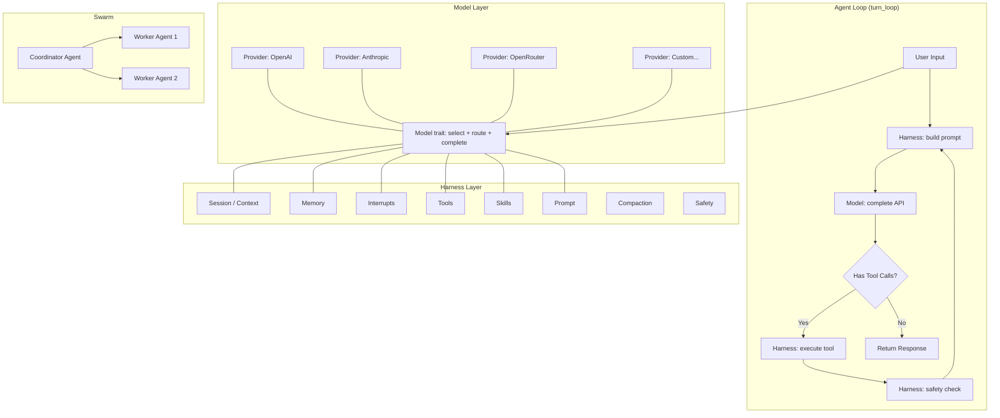
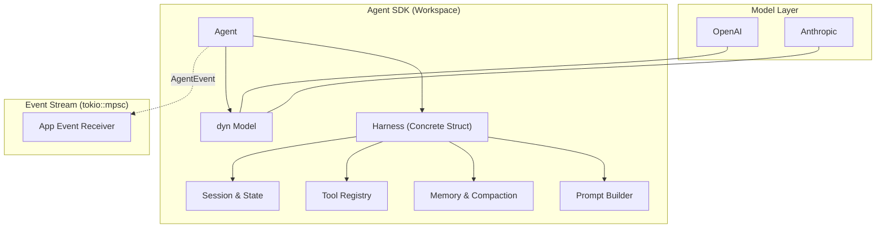
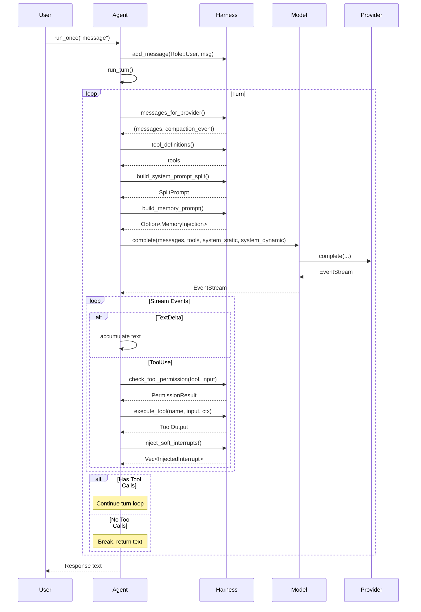

# Fox Agent SDK

## 1. 概述

Fox Agent SDK 是从 `D:\ws\ai\babycode` 项目代码库提炼出的可复用 Rust Agent SDK（产品名：`Fox Agent SDK`，crate 暂名 `fox-agent-sdk`）。核心理念为 **Agent = Model + Harness**：基于 babycode 的 codebase 抽取出可独立嵌入任意应用的 Agent 运行内核，并支持 Agent Loop、意图理解/任务规划、Swarm 多智能体协作等能力。

### 1.1 设计目标

- **无服务器依赖**: 不需要 server、channel、bridge 等基础设施
- **纯 agent 核心**: 只包含 agent 运行必需的组件
- **用户可自由选择**: model 层支持多 provider 切换
- **即插即用**: 给定 Model + Harness 即可运行完整 agent loop

### 1.2 整体架构



### 1.3 能力范围与边界（SDK Scope）

本方案里 “Agent SDK” 的定位是：提供**可嵌入任意应用**的 Agent 运行内核（Loop + 类型系统 + 扩展点），而不是 jcode 应用本身。为了避免 SDK 过度耦合 jcode 的 server/TUI/存储/账号体系，需要明确能力边界。

#### 1.3.1 SDK 必须提供（Must-have）

- **Agent Loop**：单轮/多轮执行（含工具循环、软中断注入点、最大迭代次数保护）、以及可复用的 streaming 事件管道（基于 `tokio::sync::mpsc::Sender<AgentEvent>`）。
- **LLM 抽象**：Provider/Model 抽象、流式事件统一（`StreamEvent`）、provider session（resume id）能力、model fork（用于 subagent / 隔离 provider 会话）。
- **工具系统**：Tool trait、工具注册/执行、工具输入校验、工具输出结构（含 tool_result 注入），以及与安全系统的衔接。
- **会话与上下文**：SessionState/消息存储结构、WorkingDir/环境上下文注入机制、compaction 接口（以及默认实现/策略的可选组件化）。
- **安全与权限钩子**：对工具调用的 allow/deny/ask-user 决策接口，且 SDK 不内置任何 UI 交互，只提供“需要询问用户”的结构化结果。
- **可测试性**：纯内存实现的默认 Harness（可选落盘），以及可注入的 Provider/Tool 便于单元测试与 determinism。

#### 1.3.2 SDK 可选提供（Nice-to-have / Feature-gated）

- **默认 Harness 组件集**：PromptBuilder/Compaction/Memory/SkillRegistry 等默认实现，允许按 feature 启用/禁用子模块（例如关闭 memory 或 compaction），但不承诺替换 Harness 本体实现。
- **默认工具包**：例如读写文件、代码搜索、bash 等，但应以独立 crate + feature 提供，避免 SDK 核心被具体工具污染。
- **Subagent 实现**：以 `subagent` 工具形式提供的“单次委派执行”，强调隔离会话与 provider fork（当前实现即如此）。
- **Swarm（本地/同进程）**：提供基于 shared plan 的协调逻辑与 worker 生命周期状态机，但限定为**同一进程内的多 agent 运行**（见 1.3.3）。

#### 1.3.3 SDK 明确不做（Out-of-scope）

- **分布式/跨进程 Swarm 调度**：SDK 不负责 socket、daemon、client/server 协议、跨进程 session 管理。若要支持分布式，建议在 SDK 之上提供单独的 “Swarm Runtime/Daemon” 产品层组件。
- **UI 层与交互层**：不包含 TUI/桌面 UI、渲染、输入法、回放等能力。
- **账号与密钥管理**：不包含 OAuth、token store、provider 账号切换、keychain/credential store 等；这些由应用层提供并注入 Provider。
- **应用级配置与遥测**：不包含 jcode 的全局 config、telemetry、usage 报表等；SDK 仅暴露必要配置入口与回调。
- **工程化/发布系统**：不包含更新系统、安装器、后台守护、ambient/overnight 等产品能力。

#### 1.3.4 关键责任划分（建议）

| 能力 | SDK（Fox Agent SDK / crate: `fox-agent-sdk`） | 应用层（jcode server/TUI/desktop/bridge） |
|---|---|---|
| 消息执行与工具循环 | 负责 | 触发/展示/取消 |
| Provider 调用与事件统一 | 负责（抽象 + 默认实现可选） | 提供凭据、选型、重试策略偏好 |
| Tool 执行 | 负责接口与默认执行器 | 提供具体 Tool、权限 UI、沙盒策略 |
| Swarm 协作 | 只提供同进程编排（可选） | 分布式调度/多端同步/协议 |
| streaming 事件类型 | 建议 SDK 定义 SDK 内部事件（如 AgentEvent） | server 映射到 ServerEvent，TUI 映射到 UI 事件 |

### 1.4 配置入口（Config-first）

Fox Agent SDK 统一通过配置初始化与驱动行为，不在 SDK 内部读取环境变量或通过环境变量改变行为；环境变量/配置文件的加载由应用层完成并注入 SDK。

```rust
#[derive(Clone, Debug)]
pub struct FoxAgentSdkConfig {
    pub memory: MemoryConfig,
    pub compaction: CompactionConfig,
    pub safety: SafetyConfig,
}

#[derive(Clone, Debug)]
pub struct MemoryConfig {
    pub enabled: bool,
    pub max_candidates: usize,
    pub max_results: usize,
    pub max_graph_depth: usize,
    pub sidecar_verify: bool,
}
```

说明：
- SDK 示例代码中如出现 `std::env::var(...)` 仅代表“应用层如何加载配置”的一种方式，不作为 SDK 依赖或约束。
- 配置结构体字段以 babycode 的默认值与约束为基准，必要时可扩展，但避免让配置扩散到所有类型（保持集中入口）。

## 2. 核心架构与简化分层

由于排除了第三方 Harness 的抽象需求，架构从“接口组合”演进为“实体组合”，极大地增强了落地可行性。



## 3. Model 层设计

### 3.1 Provider trait -- LLM 后端抽象

```rust
/// Provider trait: 定义如何与 LLM 后端通信
#[async_trait]
pub trait Provider: Send + Sync {
    /// 发送消息并获取流式响应 (单 system prompt)
    async fn complete(
        &self,
        messages: &[Message],
        tools: &[ToolDefinition],
        system: &str,
        resume_session_id: Option<&str>,
    ) -> Result<EventStream>;

    /// 发送消息并获取流式响应 (拆分 system prompt，利于缓存)
    async fn complete_split(
        &self,
        messages: &[Message],
        tools: &[ToolDefinition],
        system_static: &str,
        system_dynamic: &str,
        resume_session_id: Option<&str>,
    ) -> Result<EventStream>;

    /// Provider 名称 (如 "openai", "anthropic", "openrouter")
    fn name(&self) -> &str;

    /// 当前模型 ID
    fn model(&self) -> String;

    /// 设置模型
    fn set_model(&self, model: &str) -> Result<()>;

    /// 可用模型列表
    fn available_models(&self) -> Vec<&'static str>;
    fn available_models_display(&self) -> Vec<String>;

    /// 模型路由 (统一选择器用)
    fn model_routes(&self) -> Vec<ModelRoute>;

    // ── 可选能力 ──
    fn supports_image_input(&self) -> bool { false }
    fn reasoning_effort(&self) -> Option<String> { None }
    fn set_reasoning_effort(&self, effort: &str) -> Result<()>;
    fn handles_tools_internally(&self) -> bool { false }
    fn supports_compaction(&self) -> bool { false }
    fn native_compact(&self, ...) -> Result<NativeCompactionResult>;
    // ...
}
```

**提取来源**:
- `crates/jcode-provider-core/src/lib.rs` -- `trait Provider` (完整定义)
- `crates/jcode-provider-openai/`, `jcode-provider-gemini/`, `jcode-provider-openrouter/` -- 具体实现参考
- `crates/jcode-message-types/` -- `Message`, `ContentBlock`, `ToolDefinition`, `StreamEvent`

### 3.2 Model trait -- Provider 包装 + 模型选择/路由

```rust
/// Model trait: 包装 Provider，增加模型选择和路由能力
#[async_trait]
pub trait Model: Send + Sync {
    /// 核心 API: 发送消息并获取流式响应
    async fn complete(
        &self,
        messages: &[Message],
        tools: &[ToolDefinition],
        system_static: &str,
        system_dynamic: &str,
        resume_session_id: Option<&str>,
    ) -> Result<EventStream>;

    fn name(&self) -> &str;
    fn model_id(&self) -> String;
    fn context_window(&self) -> usize;
    fn set_model(&self, model: &str) -> Result<()>;
    fn available_models_display(&self) -> Vec<String>;
    fn model_routes(&self) -> Vec<ModelRoute>;

    // 子 agent fork
    fn fork(&self) -> Arc<dyn Model>;

    // 运行时状态
    fn runtime_state(&self) -> ModelRuntimeState;
    fn apply_state_event(&self, event: ModelStateEvent);

    // ...
}
```

**提取来源**:
- `crates/jcode-model/src/lib.rs` -- `trait Model` + `DefaultModel` + `ModelRuntimeState`
- `src/agent/provider.rs` -- `Agent` 上的 model 操作方法 (set_model, fork 等)

### 3.3 Model + Provider 切换

用户可自由在多个 Provider 之间切换:

```rust
// 示例: 创建 agent 并切换 model/provider
let provider_openai = Arc::new(OpenAiCompatibleProvider::new(ProviderConfig::openai("<api-key>"))?);
let model = Arc::new(DefaultModel::new(provider_openai, "gpt-4o"));
let tool_executor = default_tool_executor().await;
let harness = Harness::new(sdk_cfg, tool_executor, skills, None);
let mut agent = Agent::new(model, harness);

// 切换到不同 model
agent.set_model("gpt-4o")?;
// 或切换到不同 provider
agent.model().switch_active_provider_to("anthropic")?;
```

## 4. Harness 层设计

### 4.1 Harness 作为实体结构 (不再是 trait)

由于不考虑第三方 Harness 接入，我们将原方案中繁杂的抽象简化为具体的实体结构 `Harness`。

```rust
/// Harness: 具体的实体结构，管理所有执行上下文
pub struct Harness {
    pub session_state: SessionState,
    pub tool_executor: ToolExecutor,
    pub memory_state: MemoryInjectionState,
    pub compaction_manager: CompactionManager,
    pub safety_system: SafetySystem,
    pub prompt_builder: PromptBuilder,
    pub skill_registry: Arc<RwLock<SkillRegistry>>,
    pub interrupt_manager: InterruptManager,
}
```

**改造来源**:
- 取消 `crates/jcode-harness-core/src/lib.rs` 中的 `trait Harness`，转为直接组装实体。

### 4.2 Harness 各组件详解

#### 4.2.1 Session / Context -- 会话状态管理

```
SessionState (Reducer 模式)
├── id, parent_id, title, custom_title
├── messages: Vec<StoredMessage>
├── model, provider_key
├── compaction: Option<StoredCompactionState>
├── working_dir, status
├── memory_injections: Vec<StoredMemoryInjection>
└── env_snapshots: Vec<EnvSnapshot>
```

所有状态变化通过 `SessionEvent` → `SessionState::apply()` → `SessionChange` 单向流动。

**提取来源**:
- `src/harness/session_state.rs` -- `SessionState` + `SessionEvent` + `SessionChange` (Reducer 模式)
- `crates/jcode-session-types/` -- `StoredMessage`, `StoredCompactionState`, `EnvSnapshot`, `GitState`
- `crates/jcode-message-types/` -- `Message`, `ContentBlock`, `Role`, `ToolCall`

#### 4.2.2 Memory -- 记忆系统

```
MemoryInjectionState (Reducer 模式)
├── enabled: bool
├── pending_injection: Option<MemoryInjection>
├── last_injected_at: Option<Instant>
└── stats: injection_count, total_chars

Memory Pipeline (Async, 非阻塞)
1. Trigger  -- turn N 收集上下文并触发异步检索任务（主 Agent 不等待）
2. Search   -- 本地 embedding + 相似度检索获得初始 hits（top-k）
3. Cascade  -- 从初始 hits 在 memory graph 上做 BFS 扩展候选集（有 depth 上限）
4. Verify   -- 可选：sidecar 相关性验证与去噪（开启时输出更干净的注入集合）
5. Stage    -- 将最终注入结果写入 pending（turn N+1 消费）
6. Inject   -- turn N+1 从 pending 取出注入到 system prompt（dynamic_part）
```

设计参考（来自 babycode 的已实现方案）：
- “主 Agent 不等待 memory，turn N 计算结果在 turn N+1 生效”：见 [MEMORY_ARCHITECTURE.md](file:///d:/ws/ai/babycode/docs/MEMORY_ARCHITECTURE.md#L12-L18)
- pending injection reducer：见 [memory_state.rs](file:///d:/ws/ai/babycode/src/harness/memory_state.rs#L8-L105)
- MemoryManager（检索/缓存/pending）：见 [memory/mod.rs](file:///d:/ws/ai/babycode/src/memory/mod.rs#L120-L166)

建议默认参数（与 babycode 对齐，作为 SDK 默认值）：
- `max_candidates = 30`、`max_results = 10`（见 [memory/mod.rs](file:///d:/ws/ai/babycode/src/memory/mod.rs#L63-L66)）
- `max_graph_depth = 2`（见 [MEMORY_ARCHITECTURE.md](file:///d:/ws/ai/babycode/docs/MEMORY_ARCHITECTURE.md#L237-L325)）

**提取来源**:
- `src/harness/memory_state.rs` -- `MemoryInjectionState` + `MemoryInjectionEvent`
- `crates/jcode-memory-types/src/lib.rs` -- `MemoryState`, `PipelineState`, `MemoryEvent`, `MemoryEventKind`
- `crates/jcode-memory-types/src/graph.rs` -- `MemoryGraph`, `ClusterEntry`, `Edge`
- `crates/jcode-embedding/` -- embedding 计算

#### 4.2.3 Interrupt -- 中断系统

```
InterruptManager
├── queue: SoftInterruptQueue (软中断队列)
├── background_tool: InterruptSignal (工具转后台)
├── graceful_shutdown: InterruptSignal (优雅停止)
└── pending_alerts: Vec<String> (待注入的 swarm 告警)
```

**中断注入点**:
- Point A: 工具调用前 (跳过后续工具调用)
- Point B: 工具调用后 (在下一轮 API 调用前注入)
- Point C: 无工具调用时 (立即注入)

**提取来源**:
- `src/harness/interrupts.rs` -- `InterruptManager`
- `crates/jcode-agent-runtime/src/lib.rs` -- `SoftInterruptQueue`, `SoftInterruptMessage`, `InterruptSignal`

#### 4.2.4 Tools -- 工具系统

```rust
/// Tool trait: 定义可执行工具
#[async_trait]
pub trait Tool: Send + Sync {
    fn name(&self) -> &str;
    fn description(&self) -> &str;
    fn parameters_schema(&self) -> Value;
    async fn execute(&self, input: Value, ctx: ToolContext) -> Result<ToolOutput>;
    fn to_definition(&self) -> ToolDefinition { ... }
}

/// ToolContext: 工具执行上下文
pub struct ToolContext {
    pub session_id: String,
    pub message_id: String,
    pub tool_call_id: String,
    pub working_dir: Option<PathBuf>,
    pub graceful_shutdown_signal: Option<InterruptSignal>,
    pub execution_mode: ToolExecutionMode,
}

/// ToolExecutor: 工具注册表 + 执行
pub struct ToolExecutor {
    tools: Arc<RwLock<HashMap<String, Arc<dyn Tool>>>>,
}
```

**提取来源**:
- `crates/jcode-tool-core/src/lib.rs` -- `trait Tool`, `ToolContext`, `ToolExecutionMode`
- `src/harness/tool_executor.rs` -- `ToolExecutor`
- `src/harness/tool_state.rs` -- `ToolRegistryState` (工具注册管理)
- `crates/jcode-tool-types/` -- `ToolOutput`

#### 4.2.5 Skills -- 技能系统

```rust
/// 技能注册表
pub struct SkillRegistry {
    skills: HashMap<String, Skill>,
}

pub struct Skill {
    pub name: String,
    pub description: String,
    pub prompt: String,        // 加载时注入到 system prompt
}

impl SkillRegistry {
    pub fn load(name: &str) -> Result<()>;
    pub fn list(&self) -> Vec<SkillInfo>;
    pub fn get(&self, name: &str) -> Option<&Skill>;
}
```

**提取来源**:
- `src/harness/skill_registry.rs` -- `SkillRegistry`
- `src/harness/skill.rs` -- `Skill` 结构

#### 4.2.6 Prompt -- System Prompt 构建

```
SplitPrompt
├── static_part: String   (可缓存，来自 prompt 模板 + skill)
└── dynamic_part: String  (不可缓存，每轮变化: 环境 + 记忆 + 提醒)

PromptBuilder
├── build_split(skill, skills_list, canary, memory, working_dir) -> SplitPrompt
└── system_prompt_{platform}() -> String  (platform = cli|desktop|tui)
```

**提取来源**:
- `src/harness/prompt.rs` -- `PromptBuilder`
- `src/agent/prompting.rs` -- `build_system_prompt_split`
- `src/prompt/` -- system prompt 模板

#### 4.2.7 Compaction -- 上下文压缩

```
CompactionManager
├── mode: CompactionMode (Auto | Native | Off)
├── token_budget: usize
├── effective_tokens: usize
├── compacted_state: Option<StoredCompactionState>
│
├── hard_compact()   -- 立即丢弃旧消息保留摘要
├── force_compact()  -- 后台异步压缩
├── try_compact()    -- 根据触发条件自动压缩
└── stats()          -- 返回 CompactionStats
```

**触发条件 (`CompactionTrigger`)**:
- `TokenBudget` -- token 预算超限
- `Manual` -- 用户手动触发
- `TurnCount` -- 轮次过多
- `ContextLimitApproaching` -- provider 提示接近限制

**提取来源**:
- `src/harness/compaction.rs` -- `CompactionManager`
- `src/agent/compaction.rs` -- agent 层 compaction 逻辑
- `crates/jcode-compaction-core/` -- 压缩核心逻辑
- `crates/jcode-harness-core/` -- `CompactionTrigger`, `CompactionEvent`

#### 4.2.8 Safety -- 安全/权限系统

```
SafetySystem
├── action_log: Vec<ActionLog>
├── pending: Vec<PermissionRequest>
├── decisions: HashMap<request_id, Decision>
│
├── check(tool_name, input) -> PermissionResult
│   ├── Allow
│   ├── Deny(reason)
│   └── AskUser { tool_name, prompt }
└── tiers: ActionTier (AutoAllowed | RequiresPermission)
```

**提取来源**:
- `src/harness/safety.rs` -- `SafetySystem`, `PermissionRequest`, `PermissionResult`, `ActionTier`

## 5. Agent Loop -- 核心运行循环

```rust
pub struct Agent {
    model: Arc<dyn Model>,
    harness: Harness,
    pending_permission: Option<PermissionRequest>,
}

impl Agent {
    /// 运行结果：完成文本，或需要用户决策以继续
    pub async fn run_once_capture(&mut self, user_message: &str) -> Result<TurnOutcome>;

    /// 运行单轮 (无流式输出)
    pub async fn run_once(&mut self, user_message: &str) -> Result<()>;

    /// 运行单轮并流式输出事件
    pub async fn run_once_streaming(
        &mut self,
        user_message: &str,
        event_tx: &AgentEventTx,
    ) -> Result<TurnOutcome>;

    /// 当返回 RequiresUserDecision 时，应用层把决策回填并恢复执行
    pub async fn resume_streaming(
        &mut self,
        decision: PermissionDecision,
        event_tx: &AgentEventTx,
    ) -> Result<TurnOutcome>;

    /// 核心 turn loop (SDK 内部)
    async fn run_turn_streaming(&mut self, event_tx: &AgentEventTx) -> Result<TurnOutcome> {
        let mut final_text = String::new();
        loop {
            final_text.clear();
            // 1. 获取 provider 消息 (含 compaction)
            let (messages, compaction_event) = self.messages_for_provider();
            let tools = self.tool_definitions().await;

            // 2. 构建 system prompt (split)
            let split = self.build_system_prompt_split(None);

            // 3. 注入 memory
            let memory = self.build_memory_prompt(&messages, None).await;

            // 4. 调用 Model API
            let stream = self.model.complete(
                &messages, &tools,
                &split.static_part, &split.dynamic_part,
                self.model.provider_session_id().as_deref(),
            ).await?;

            // 5. 处理流式响应
            let mut saw_tool_call = false;
            while let Some(event) = stream.next().await {
                match event {
                    StreamEvent::TextDelta { text } => {
                        final_text.push_str(&text);
                        let _ = event_tx.send(AgentEvent::ModelTextDelta { text }).await;
                    }
                    StreamEvent::ToolUse { id, name, input } => {
                        saw_tool_call = true;
                        let _ = event_tx.send(AgentEvent::ToolCallStart {
                            call_id: id,
                            name,
                            input,
                        }).await;
                        // 6. 安全检查
                        let perm = self.check_tool_permission(&name, &input).await;
                        if let PermissionResult::AskUser { request_id, tool_name, prompt } = perm {
                            let request = PermissionRequest { request_id, tool_name, prompt };
                            self.pending_permission = Some(request.clone());
                            let _ = event_tx.send(AgentEvent::PermissionRequest {
                                request_id: request.request_id.clone(),
                                tool_name: request.tool_name.clone(),
                                prompt: request.prompt.clone(),
                            }).await;
                            return Ok(TurnOutcome::RequiresUserDecision { request });
                        }
                        // 7. 执行工具
                        let ctx = ToolContext {
                            session_id: self.harness.session_state.id.clone(),
                            message_id: "<message_id>".to_string(),
                            tool_call_id: id.clone(),
                            working_dir: self.harness.session_state.working_dir.clone(),
                            graceful_shutdown_signal: Some(self.harness.interrupt_manager.graceful_shutdown.clone()),
                            execution_mode: ToolExecutionMode::Foreground,
                        };
                        let output = self.execute_tool(&name, input, ctx).await?;
                        let _ = event_tx.send(AgentEvent::ToolCallEnd {
                            call_id: id,
                            output,
                        }).await;
                        // 8. 注入软中断
                        let interrupts = self.inject_soft_interrupts();
                        for interrupt in interrupts {
                            let _ = event_tx
                                .send(AgentEvent::SoftInterruptInjected { interrupt })
                                .await;
                        }
                        // 9. 重复循环...
                    },
                    StreamEvent::MessageStop => break,
                }
            }
            // 如果无工具调用，退出循环
            if !saw_tool_call {
                break;
            }
        }
        Ok(TurnOutcome::Completed { text: final_text })
    }
}
```

**提取来源**:
- `src/agent/turn_loops.rs` -- `run_turn` (完整 turn loop)
- `src/agent/turn_execution.rs` -- `run_once`, `run_once_capture`, `run_once_streaming`

### 5.1 Agent Loop 关键流程



### 5.2 SDK Streaming 事件模型（AgentEvent）

SDK 对外的 streaming 需要是**应用无关**的：不能直接暴露 `ServerEvent`/wire protocol，也不应依赖某个 UI 框架。SDK 只定义稳定的事件模型 `AgentEvent`，并统一通过异步 channel (`tokio::sync::mpsc::Sender<AgentEvent>`) 下发，应用层按需适配到 TUI/HTTP SSE/WebSocket 等载体。

#### 5.2.1 设计原则

- **稳定性优先**：事件字段应尽量是跨 provider 的抽象（文本 delta、工具调用、权限请求、错误等），避免把某家 provider 的细节固化成 SDK API。
- **最小充分集**：SDK 必须能表达 agent loop 的关键阶段；其余信息（debug、raw provider event）通过可选事件或 feature 控制。
- **可组合**：应用层可以把 `AgentEvent` 适配为自己的 `ServerEvent`/UI event；SDK 不做渲染，不做协议封装。
- **可回放**：事件应该足够重建一次对话回放（至少：文本 delta、工具调用与结果、最终完成/错误）。

#### 5.2.2 推荐 API 草案

```rust
pub type AgentEventTx = tokio::sync::mpsc::Sender<AgentEvent>;

#[derive(Clone, Debug)]
pub enum AgentEvent {
    TurnStart { turn_id: u64 },
    TurnEnd { turn_id: u64, outcome: TurnOutcome },

    ModelTextDelta { text: String },
    ModelMessageStart { message_id: String },
    ModelMessageEnd { message_id: String },
    ModelUsage { usage: TokenUsage },

    ToolCallStart { call_id: String, name: String, input: serde_json::Value },
    ToolCallEnd { call_id: String, output: ToolOutput },

    PermissionRequest { request_id: String, tool_name: String, prompt: String },

    Compaction { event: CompactionEvent },
    MemoryInjected { label: String, size_bytes: usize },
    SoftInterruptInjected { interrupt: InjectedInterrupt },

    Error { message: String, retry_after_secs: Option<u64> },
}

#[derive(Clone, Debug)]
pub enum TurnOutcome {
    Completed { text: String },
    Cancelled,
    RequiresUserDecision { request: PermissionRequest },
    Failed { error: AgentError },
}
```

说明：
- streaming 统一为 `tokio::sync::mpsc::Sender<AgentEvent>`；应用层根据自身载体（TUI/SSE/WebSocket）消费并适配。
- 背压语义由 channel 容量控制：SDK 在 send 时 await；若 receiver 已关闭，SDK 可选择忽略或返回错误（建议忽略并继续 run）。
- `ToolOutput` 建议保持结构化（例如 `text`、`json`、`attachments` 等），便于上层显示与持久化。
- `PermissionRequest` 表达 “AskUser” 的语义：SDK 只上报需要用户决策，具体的 UI/协议交互由应用层完成。

#### 5.2.3 与 Provider StreamEvent 的映射关系（建议）

- `StreamEvent::TextDelta` → `AgentEvent::ModelTextDelta`
- `StreamEvent::{ToolUseStart, ToolInputDelta, ToolUseEnd}` → `AgentEvent::{ToolCallStart, ToolCallEnd}`（如需要展示输入增量，可扩展 `ToolCallInputDelta`）
- `StreamEvent::MessageStart/MessageStop` → `AgentEvent::{ModelMessageStart, ModelMessageEnd}`
- provider token usage / cached token 统计 → `AgentEvent::ModelUsage`

SDK 允许把 provider 的 raw 事件作为 debug 能力暴露，但建议 feature gate，避免污染稳定 API。

#### 5.2.4 与 Swarm 的关系

- `AgentEvent` 负责单个 agent 的 loop streaming。
- Swarm（同进程编排）建议提供独立的 `SwarmEvent`（如：成员加入/退出、任务分配/状态变更、plan version 更新），应用层可同时订阅 `AgentEvent` 与 `SwarmEvent`。
- 若希望统一出口，也可以用 `AgentEvent::Swarm { swarm_id, event }` 做封装，但不建议把应用层 `ServerEvent` 直接挪进 SDK。

## 6. Swarm 多智能体

### 6.1 Swarm 架构

```
Swarm Coordinator (Agent)
├── plan: Vec<PlanItem>  (共享任务列表)
├── workers: Vec<Agent>  (worker 实例)
│
├── spawn()      → 创建 worker agent
├── assign_task() → 分配任务给 worker
├── broadcast()  → 广播消息
├── dm()         → 直接消息
├── report()     → worker 汇报完成
└── plan_status() → 查看计划状态
```

边界说明：
- SDK Swarm 只覆盖“同进程多 agent 编排”：coordinator/worker 是同一进程内的实例或句柄，状态在内存中推进（可选持久化）。
- 跨进程/跨机器协作（daemon、socket、wire protocol、多客户端同步）属于应用层或单独 runtime，不属于 SDK 核心。

### 6.2 Worker Agent 生命周期

```
Spawned → Ready → Running → Completed
                     ↓
                 Blocked → Running
                     ↓
                 Failed / Stopped / Crashed
```

### 6.3 Swarm 交互模型

```rust
/// Swarm 协调器
pub trait SwarmCoordinator {
    /// 创建 worker agent
    fn spawn(&mut self, prompt: &str) -> Result<AgentHandle>;

    /// 分配任务
    fn assign_task(&mut self, task_id: &str, agent: &AgentHandle) -> Result<()>;

    /// 广播消息给所有 worker
    fn broadcast(&mut self, msg: &str);

    /// 直接消息给特定 worker
    fn dm(&mut self, agent: &AgentHandle, msg: &str);

    /// 等待 worker 完成
    async fn await_members(&self, mode: AwaitMode) -> Result<Vec<AgentReport>>;
}

/// Worker handle (跨线程安全)
pub struct AgentHandle {
    session_id: String,
    status: Arc<Atomic<SwarmLifecycleStatus>>,
}
```

**提取来源**:
- `crates/jcode-swarm-core/src/lib.rs` -- `SwarmRole`, `SwarmLifecycleStatus`, swarm 类型定义
- `crates/jcode-plan/src/lib.rs` -- `PlanItem`, `VersionedPlan`, `SwarmExecutionState`
- `src/swarm/` -- swarm 管理逻辑
- `src/agent/mod.rs` -- `Agent` struct (swarm 所用的 agent 实例)

### 6.4 Swarm 的 SDK 边界（重要）

本 SDK 方案中的 Swarm 仅讨论“同进程多 agent 编排”，即：
- coordinator/worker 都是同一进程内的 `Agent` 实例或句柄
- plan/成员状态由内存结构维护（可选落盘），不依赖 socket 协议
- 如果需要跨进程/跨机器协作（daemon + 多客户端），那属于应用层（server/bridge）或单独 runtime，不属于 SDK 核心

## 7. 意图理解 & 任务规划

### 7.1 意图识别

Agent 通过 system prompt 中的指令进行意图理解:

```rust
/// Intent recognition is prompt-driven, not a separate module.
/// The system prompt instructs the model to:
///   1. Understand user intent
///   2. Create structured plans (via todo tool)
///   3. Track progress with checkpoints
///   4. Autonomously complete multi-step tasks
```

### 7.2 任务规划 (todo / goal / plan)

```rust
/// Todo tool -- session-local task list
pub struct TodoItem {
    pub id: String,
    pub content: String,      // 任务描述
    pub status: String,       // pending | in_progress | completed
    pub priority: String,     // high | normal | low
}

/// Goal tool -- 持久化目标追踪
pub struct Goal {
    pub id: String,
    pub title: String,
    pub description: String,
    pub milestones: Vec<Milestone>,
    pub progress_percent: i32,
    pub status: String,
}

/// Plan -- swarm 共享计划
pub struct PlanItem {
    pub id: String,
    pub content: String,
    pub status: String,
    pub priority: String,
    pub assigned_to: Option<String>,
    pub blocked_by: Vec<String>,
}
```

**提取来源**:
- `crates/jcode-plan/src/lib.rs` -- `PlanItem`, `VersionedPlan`, `SwarmExecutionState`
- `src/tool/` 下的 todo/goal/plan 工具实现

## 8. Crate 重组与实施路径 (Actionable Plan)

原方案将 SDK 拆分为 27 个细碎的 Crate，这在实际工程中会导致严重的“版本地狱”和开发摩擦。落地方案将其合并为 **5 个核心 Crate**。

### 8.1 Crate 拓扑结构

```text
fox-agent-sdk (Workspace)
 ├── fox-agent-core       # 核心类型、Trait、Event定义 (Message, Tool trait, Provider trait)
 ├── fox-agent-providers  # LLM 后端实现 (OpenAI, Anthropic 等，通过 feature gate 控制)
 ├── fox-agent-tools      # 内置的基础工具集 (fs, bash, todo, plan)
 ├── fox-agent-swarm      # 多智能体编排逻辑
 └── fox-agent-sdk        # 主入口、Agent Loop、Harness 具体实现
```

### 8.2 实施里程碑 (Milestones)

#### Phase 1: 基础骨架与类型迁移 (Week 1)
- 初始化 Workspace，创建 5 个基础 crate。
- 从 `babycode` 迁移基础数据结构（Message, StreamEvent, ToolDefinition）到 `fox-agent-core`。
- 清理所有与 `jcode-gateway/server` 相关的依赖。

#### Phase 2: Provider 与基础 Tool 迁移 (Week 1-2)
- 将 OpenAI/Anthropic 的实现迁移到 `fox-agent-providers`。
- 将文件读写、Bash 执行等基础工具迁移到 `fox-agent-tools`。

#### Phase 3: Harness 与 Agent Loop 构建 (Week 2-3)
- 在 `fox-agent-sdk` 中实现具体的 `Harness` 结构体（合并原有的 SessionState, Compaction, Memory）。
- 实现带 `TurnOutcome::RequiresUserDecision` 的 `run_turn` 和 `resume` 状态机。
- 接入 `tokio::sync::mpsc` 事件流。

#### Phase 4: 规划能力与 Swarm (Week 3-4)
- 迁移 `todo/goal/plan` 到 `fox-agent-tools` 并集成到默认 Prompt 构建流程中。
- 在 `fox-agent-swarm` 中实现 `SwarmCoordinator`，跑通同进程的 Parent-Worker 协作 Case。

## 9. SDK 公共 API 设计

```rust
// fox-agent-sdk/src/lib.rs

pub use fox_agent_core::*;

#[cfg(feature = "providers")]
pub use fox_agent_providers::*;

#[cfg(feature = "tools")]
pub use fox_agent_tools::*;

#[cfg(feature = "swarm")]
pub use fox_agent_swarm::*;
```

### 9.1 典型使用示例

```rust
use fox_agent_sdk::*;

#[tokio::main]
async fn main() -> Result<()> {
    // 0. 应用层加载配置（可来自文件/环境变量/参数；SDK 不依赖 env）
    let sdk_cfg = FoxAgentSdkConfig {
        memory: MemoryConfig {
            enabled: true,
            max_candidates: 30,
            max_results: 10,
            max_graph_depth: 2,
            sidecar_verify: false,
        },
        compaction: CompactionConfig::default(),
        safety: SafetyConfig::default(),
    };

    // 1. 创建 Provider (选择 LLM 后端) —— 凭据由应用层注入
    let provider = Arc::new(OpenAiCompatibleProvider::new(
        ProviderConfig::openai("<provided-by-app>")
    )?);

    // 2. 创建 Model (包装 Provider + 模型选择)
    let model = Arc::new(DefaultModel::new(provider, "gpt-4o"));

    // 3. 创建 / 注册 Tools
    let tool_executor = default_tool_executor().await;

    // 4. 创建 Harness (执行框架，实体结构体)
    let harness = Harness::new(
        sdk_cfg,
        tool_executor,
        Arc::new(RwLock::new(SkillRegistry::default())),
        None,
    );

    // 5. 创建 Agent
    let mut agent = Agent::new(model, harness);

    // 6. 运行 Agent Loop
    let (event_tx, mut event_rx) = tokio::sync::mpsc::channel::<AgentEvent>(256);
    tokio::spawn(async move {
        while let Some(ev) = event_rx.recv().await {
            // 应用层处理 streaming 事件
            let _ = ev;
        }
    });

    let outcome = agent.run_once_streaming("帮我写一个 Rust hello world", &event_tx).await?;
    match outcome {
        TurnOutcome::Completed { text: _ } => {}
        TurnOutcome::RequiresUserDecision { request: _ } => {
            // 应用层获取用户输入后调用 resume_streaming(...)
        }
        _ => {}
    }

    Ok(())
}
```

## 10. 目录结构总览

```
fox-agent-sdk/
├── Cargo.toml                          # workspace / root package
│
├── crates/
│   ├── fox-agent-core/               # 核心类型 (Message, Tool trait, StreamEvent)
│   ├── fox-agent-providers/          # LLM 后端实现 (OpenAI, Anthropic 等)
│   ├── fox-agent-tools/              # 基础工具集 (fs, bash, todo, plan)
│   ├── fox-agent-swarm/              # Swarm 编排逻辑
│   └── fox-agent-sdk/                # 主入口 (Agent, Harness, AgentEvent)
│
├── examples/
│   ├── simple_agent.rs                 # 基础 agent 示例
│   ├── multi_provider.rs               # 多 provider 切换示例
│   ├── swarm_demo.rs                   # swarm 多智能体示例
│   └── custom_tool.rs                  # 自定义 tool 示例
│
└── docs/
    └── agent_sdk.md                    # 本文档
```

## 11. 验收标准（Acceptance Criteria）

- Given 注册了一个返回 `AskUser` 的高风险工具权限策略 When agent 运行到该工具调用 Then `run_once_*` 返回 `TurnOutcome::RequiresUserDecision { request }` 且不会执行该工具
- Given 应用层对 `request` 做出 `PermissionDecision` When 调用 `agent.resume_streaming(decision, event_tx)` Then agent 继续执行并最终返回 `TurnOutcome::Completed { text }` 或 `TurnOutcome::Failed { error }`
- Given `tokio::sync::mpsc::Sender<AgentEvent>` 容量为 N When agent 产生大量 `ModelTextDelta` Then 事件按产生顺序送达；channel 满时 send 会 await；receiver 关闭时不会导致 panic
- Given 应用层通过配置关闭 memory When agent 连续运行多轮 Then 不触发 memory 检索任务，system prompt 中不包含 memory 注入段
- Given 开启 memory When turn N 触发 memory 检索 Then 主 turn 不等待检索完成；检索结果最多在 turn N+1 注入（pending injection 被消费）
- Given SDK 初始化时提供 `FoxAgentSdkConfig` When 运行时改变环境变量 Then SDK 行为不发生变化（配置为唯一行为来源）

## 12. 非功能需求（NFR）

- **兼容性**：目标平台 Windows/Linux/macOS；不依赖 babycode/jcode 的 server 模块
- **可观测性**：所有 tool call 与 permission request 必须可通过 `AgentEvent` 观测到（至少包含 call_id/request_id）
- **可靠性**：工具循环必须有最大迭代次数保护，避免无限 tool loop；AskUser 必须可恢复
- **性能**：memory 检索/验证必须异步不阻塞主 turn；compaction 在 token 预算逼近时触发
- **安全**：SDK 不内置 UI，不直接执行高风险动作；所有权限决策通过 `Allow/Deny/AskUser` 输出并由应用层承接交互

## 13. 关键设计决策

### 13.1 为什么用 trait 而非具体类型

- `Model: trait` -- 允许用户替换模型选择逻辑
- `Provider: trait` -- 允许接入任意 LLM 后端
- `Tool: trait` -- 允许注册任意工具
- `Harness: struct` -- SDK 内聚的执行框架实体；不提供第三方替换 Harness 本体的扩展承诺

### 13.2 Reducer 模式 (SessionState / MemoryInjectionState)

所有状态变更通过 `Event → apply() → Change` 单向流动，确保:
- 状态变更有明确的语义标签
- 外部订阅者可以观察 `Change` 而非轮询
- 方便测试和调试

### 13.3 Split System Prompt

system prompt 分为 `static_part` (可缓存) 和 `dynamic_part` (每轮变化)，最大化 provider 的 prompt caching 收益。

### 13.4 Soft Interrupt 设计

中断不是暴力取消，而是在安全点注入消息:
- 工具调用前 / 后
- 无工具调用时立即注入
- 支持跨线程安全入队

### 13.5 Provider 作为 feature gate

Provider 实现作为 optional features，用户按需引入，减小编译体积:
```toml
[dependencies]
fox-agent-sdk = { version = "0.1", features = ["openai", "anthropic"] }
```
