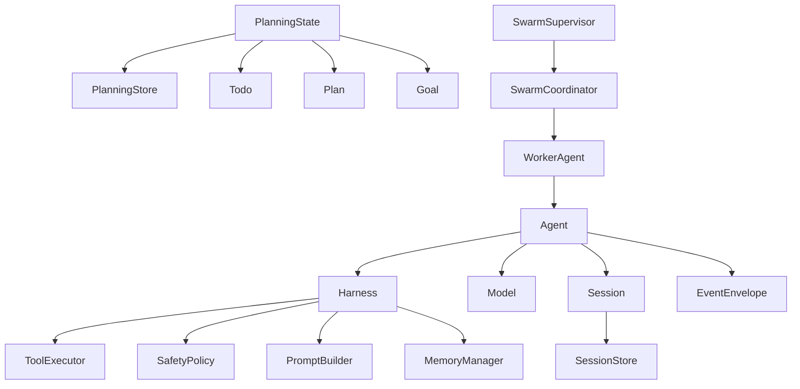

# Fox Agent SDK 应用开发优化 PRD

## 1. 项目概述

### 1.1 背景

当前 `fox-agent-sdk` 已具备较完整的 Agent 运行内核能力，包括：

- Agent Loop 与多轮工具调用
- Provider / Model 抽象与多模型接入
- Tool 注册、执行与 Sandbox 校验
- AskUser 权限中断与恢复
- Memory / Compaction / Interrupt / Prompt 注入
- 同进程 Swarm 的基础编排能力

从 SDK 内核角度看，这些能力已经可以支撑“能跑起来”的 Agent。但从应用开发角度看，当前 SDK 仍偏向运行时引擎，而不是一个可直接支撑产品落地的“应用型 Agent SDK”。

主要问题集中在：

- 状态与规划数据缺少持久化闭环
- 应用装配成本较高
- 事件模型偏内核运行视角，不够利于 UI / 审计 / 观测 / 回放
- 权限系统仅具备基础 allow / deny / ask-user 能力
- Swarm 仍停留在 coordinator primitive 层
- 缺少面向真实应用场景的模板与接入范式

因此需要围绕“应用开发可落地性”对 SDK 做一次产品化增强。

### 1.2 目标

- 将 `fox-agent-sdk` 从“可复用 Agent 内核”升级为“适合业务应用接入的 Agent SDK”
- 显著降低应用层接入、装配、治理和测试成本
- 补齐会话持久化、规划持久化、权限审批、事件治理、可观测性等产品化能力
- 为后续 CLI / TUI / Desktop / Server 等应用形态提供稳定的 SDK 底座

### 1.3 非目标

- 本阶段不实现跨进程或分布式 Swarm
- 本阶段不实现 UI 层、Server 层、账户体系、云端控制台
- 本阶段不引入与业务强耦合的应用配置系统
- 本阶段不将 SDK 改造成重型平台框架

### 1.4 成功标准

- 应用方可通过标准 Builder 在 30 行以内完成一个带 Provider / Tool / Safety / SessionStore 的 Agent 初始化
- SDK 提供可恢复的会话与规划状态持久化能力
- SDK 事件可直接驱动日志、UI、审计和回放
- 权限审批支持会话级缓存、超时和可解释来源
- Swarm 可支撑最小可用的任务协调、失败恢复与结果汇总

## 2. 用户角色

### 2.1 角色定义

| 角色 | 描述 | 主要诉求 |
|---|---|---|
| SDK 接入开发者 | 将 Agent 嵌入 CLI、桌面端、服务端或业务系统的工程师 | 快速接入、低装配成本、稳定 API |
| 产品研发团队 | 基于 SDK 构建 AI Agent 应用的团队 | 可观测、可治理、可扩展 |
| 安全 / 合规负责人 | 关注工具调用、外部请求、数据访问边界 | 审批闭环、审计日志、权限策略 |
| 测试 / 质量工程师 | 验证 Agent 行为稳定性的角色 | 回放、Mock、确定性测试 |

### 2.2 核心用户故事

1. 作为应用开发者，我希望可以快速创建一个带默认能力的 Agent，而不是手工组装多个底层对象。
2. 作为产品团队，我希望 Agent 的会话、计划、目标和执行记录在应用重启后仍可恢复。
3. 作为安全负责人，我希望所有高风险工具操作都有可解释的审批策略和审计记录。
4. 作为测试工程师，我希望能回放一次真实会话，并稳定复现行为。
5. 作为多 Agent 应用开发者，我希望 worker 有明确状态、失败恢复和任务汇总能力。

## 3. 当前能力审视

### 3.1 已具备能力

- Agent Loop：支持单轮、多轮、工具循环、流式事件
- Provider / Model：支持 OpenAI / Anthropic / DeepSeek / Mock
- Tool 系统：支持注册、执行、sandbox 校验与默认工具集
- Safety：支持 allow / deny / ask-user
- Prompt：支持 memory / planning context 注入
- Swarm：支持同进程 coordinator、任务分配、广播、私信、成员等待

### 3.2 当前缺口

- 会话状态未形成标准持久化接口
- `todo / plan / goal` 仍是进程内存态，不适合真实应用
- 缺少标准 `AgentBuilder`
- 事件缺少稳定信封和关联字段
- 权限系统缺少审批缓存、超时、策略来源解释
- 缺少系统级 telemetry / metrics / cost tracking
- Swarm 缺少 supervisor、失败恢复、任务重分配
- 缺少模板级 examples 和应用接入指南

## 4. 产品需求

### 4.1 模块一：会话与状态持久化

#### 目标

为 Agent 应用提供可恢复、可快照、可回放的状态基础设施。

#### 功能需求

- 定义 `SessionStore` 抽象
- 支持 `save_session / load_session / snapshot / delete / list`
- Session 至少包含：
  - session_id
  - working_dir
  - messages
  - model runtime state
  - pending permission
  - interrupt state
  - metadata
- 提供默认实现：
  - `InMemorySessionStore`
  - `FileSessionStore`
- 支持 turn 结束后自动快照
- 支持从 snapshot 恢复 Agent 运行

#### 验收标准

- Given 一个已运行过 3 轮的 session
- When 应用退出并重新加载 session
- Then Agent 可以恢复消息历史、模型状态和未完成上下文

- Given 一个启用了文件存储的 Agent
- When 每轮执行完成
- Then SDK 自动保存最新 session snapshot

### 4.2 模块二：规划状态持久化

#### 目标

将 `todo / plan / goal` 从进程内状态升级为应用可依赖的规划数据能力。

#### 功能需求

- 定义 `PlanningStore` 抽象
- 将以下能力改为通过 store 读写：
  - todo
  - shared plan
  - goal
- 支持 session scope 与 global scope
- 支持版本号、更新时间、来源字段
- 支持 merge / replace / append checkpoint
- 支持按 session / goal / task 检索

#### 验收标准

- Given 一个 session 已写入 todo、plan、goal
- When 进程重启
- Then 可从 store 完整恢复这些数据

- Given 一个 goal 被 checkpoint 更新
- When 读取 goal
- Then 可以看到最新进度、checkpoint 时间和摘要

### 4.3 模块三：应用装配与 Builder

#### 目标

降低业务应用初始化 Agent 的复杂度。

#### 功能需求

- 提供 `AgentBuilder`
- Builder 至少支持配置：
  - provider
  - model_id
  - sdk config
  - session store
  - planning store
  - sandbox
  - safety policy
  - default tools
  - custom tools
- 提供一键构建：
  - `build_agent()`
  - `build_swarm_runtime()`
- 支持合理默认值

#### 验收标准

- Given 应用方只提供 provider config 与 working_dir
- When 使用 `AgentBuilder`
- Then 能构造一个可直接运行的 Agent

- Given 应用方需要注册 2 个自定义工具
- When 使用 Builder
- Then 无需直接操作 Harness 内部结构即可完成注册

### 4.4 模块四：事件治理与回放

#### 目标

让 SDK 事件可直接用于 UI、日志、审计、BI 和 replay。

#### 功能需求

- 在 `AgentEvent` 之外增加 `EventEnvelope`
- Envelope 标准字段：
  - event_id
  - session_id
  - turn_id
  - timestamp
  - trace_id
  - parent_event_id
  - source
- 提供 `EventRecorder`
- 支持事件导出和回放
- 支持 turn transcript 导出

#### 验收标准

- Given 一个完整的 agent 执行过程
- When 应用记录全部事件
- Then 可以按时间顺序完整回放关键执行过程

- Given 一个 tool 执行失败
- When 事件被导出
- Then 可通过 `session_id + trace_id + event_id` 唯一定位问题

### 4.5 模块五：权限审批工作流

#### 目标

从基础权限判断升级到应用可用的审批工作流。

#### 功能需求

- 为 `PermissionRequest` 增加：
  - approval_id
  - risk_level
  - expires_at
  - policy_source
  - tool_summary
- 支持审批决策范围：
  - 仅本次
  - 本会话
  - 当前工作区
- 支持审批缓存
- 支持超时自动拒绝
- 支持保留审批审计记录

#### 验收标准

- Given 某高风险 tool 请求审批
- When 用户选择“本会话允许”
- Then 后续同类请求无需再次询问用户

- Given 审批请求超时
- When 超过配置时间
- Then SDK 自动返回拒绝结果并记录来源为 timeout

### 4.6 模块六：运行治理与观测

#### 目标

提供面向真实生产应用的运行边界控制与观测基础。

#### 功能需求

- 增加统一治理配置：
  - provider timeout
  - provider retry
  - tool timeout
  - tool concurrency limit
  - token budget
  - cost budget
- 增加官方 metrics hook
- 输出关键指标：
  - turn latency
  - provider latency
  - tool latency
  - tool error rate
  - token usage
  - estimated cost
  - compaction count

#### 验收标准

- Given 应用启用 metrics hook
- When agent 完成一轮执行
- Then 应用能拿到 turn latency、tool latency 和 usage 数据

- Given 单次运行超过预算
- When 超出 token 或 cost limit
- Then SDK 能终止后续流程并返回结构化错误

### 4.7 模块七：Swarm 产品化增强

#### 目标

让同进程 Swarm 从“原语层”升级为可用于应用开发的最小产品能力。

#### 功能需求

- 在 coordinator 之上增加 supervisor 能力
- 补齐 worker 生命周期：
  - ready
  - running
  - blocked
  - completed
  - failed
  - timed_out
- 支持：
  - 失败上报
  - 重试
  - 任务重分配
  - 汇总报告
  - worker health check
- 支持 supervisor 视角的聚合接口

#### 验收标准

- Given 一个 worker 任务失败
- When supervisor 检测到失败
- Then 可按策略选择重试或转派给其他 worker

- Given 所有 worker 完成
- When supervisor 收敛执行结果
- Then 可以得到完整任务完成摘要

### 4.8 模块八：开发者体验与模板

#### 目标

让应用开发者能快速理解和复用 SDK。

#### 功能需求

- 提供标准 example：
  - 单 Agent CLI
  - AskUser 审批流
  - 文件沙箱代理
  - Swarm 执行器
- 提供测试模板：
  - MockProvider 回放
  - Tool stub
  - golden transcript replay
- 提供最小接入样例

#### 验收标准

- Given 一个新的业务项目
- When 参考 example 接入
- Then 开发者能在半天内跑通一个具备权限与工具能力的 Agent

## 5. 非功能需求

### 5.1 性能

- Session / Planning 存储默认实现需满足单机低并发应用场景
- 单轮状态快照不能显著阻塞主 Agent Loop
- 事件记录器应支持异步写入

### 5.2 安全

- 权限审批必须支持策略可解释性
- 默认工具需要受 sandbox 约束
- 敏感信息在事件和日志导出中必须支持脱敏

### 5.3 可用性

- 核心 API 保持简洁，Builder 优先于底层细碎装配
- 默认实现可开箱即用
- 每个关键扩展点都应可替换

### 5.4 可测试性

- 所有存储接口必须提供内存实现
- 所有治理能力必须支持 mock / deterministic 测试
- 关键流程必须支持 transcript replay

## 6. 领域模型

### 6.1 核心领域概念

- `Agent`：执行 Agent Loop 的聚合根
- `Harness`：Agent 运行时装配容器
- `Model`：封装 provider 与 model route 的执行体
- `Session`：一次 Agent 会话及其状态快照
- `PlanningState`：todo / plan / goal 的规划域对象
- `PermissionRequest`：待审批的权限请求
- `EventEnvelope`：对外稳定事件对象
- `SwarmCoordinator`：多 Agent 协作编排器
- `SwarmSupervisor`：Swarm 产品化治理对象

### 6.2 领域模型图

## 7. 开发计划

### 7.1 里程碑划分

| 里程碑 | 目标 | 主要交付 |
|---|---|---|
| M1 | 补齐状态闭环 | SessionStore、PlanningStore、文件存储实现 |
| M2 | 降低接入门槛 | AgentBuilder、SwarmRuntimeBuilder、默认装配策略 |
| M3 | 完善应用治理 | EventEnvelope、Permission Workflow、Metrics Hook |
| M4 | 强化协作与测试 | Swarm Supervisor、Replay、Examples、测试模板 |

### 7.2 任务拆解

| 编号 | 任务 | 模块 | 预估工作量 |
|---|---|---|---|
| T1 | 设计 SessionStore trait 与内存实现 | 会话 | 2d |
| T2 | 实现 FileSessionStore 与 snapshot 流程 | 会话 | 3d |
| T3 | 设计 PlanningStore trait 并改造 todo/plan/goal | 规划 | 3d |
| T4 | 实现 AgentBuilder | 装配 | 2d |
| T5 | 实现 EventEnvelope 与 EventRecorder | 事件 | 3d |
| T6 | 扩展 PermissionRequest / Decision 模型 | 权限 | 2d |
| T7 | 实现审批缓存与超时机制 | 权限 | 2d |
| T8 | 实现运行治理配置与 metrics hook | 治理 | 3d |
| T9 | 实现 SwarmSupervisor 最小版本 | Swarm | 4d |
| T10 | 补 examples 与 replay 测试模板 | DX | 3d |

### 7.3 迭代建议

#### Iteration 1

- SessionStore
- PlanningStore
- File persistence

#### Iteration 2

- AgentBuilder
- EventEnvelope
- EventRecorder

#### Iteration 3

- Permission workflow
- Metrics / cost / runtime governance

#### Iteration 4

- SwarmSupervisor
- Replay
- Examples

## 8. 验收标准

### 8.1 全局验收

- 应用方能通过 Builder 在低代码量下初始化一个完整 Agent
- Agent 会话、规划和审批状态支持恢复
- 事件可用于 UI、日志和回放
- Swarm 支持失败处理与汇总
- examples 可覆盖单 Agent、权限流和 swarm 三类核心应用场景

### 8.2 验收用例

#### 用例一：会话恢复

- Given 一个已经运行中的 Agent 会话
- When 应用保存 session 并重启
- Then 重新载入后消息历史、模型状态和待处理上下文保持一致

#### 用例二：审批缓存

- Given 用户对某工具选择“本会话允许”
- When Agent 在同会话再次调用该工具
- Then SDK 不再生成新的 AskUser 事件

#### 用例三：事件回放

- Given 一次完整执行的事件流
- When 使用 EventRecorder 导出并重放
- Then 能正确恢复 turn 顺序、tool 执行和错误节点

#### 用例四：Swarm 失败重分配

- Given 一个 worker 执行任务失败
- When supervisor 启用 retry 或 reassignment 策略
- Then 任务可被再次执行或转派

## 9. 风险与约束

- 若状态持久化接口设计过晚，后续 builder / replay / swarm 均会重复改造
- 若事件信封未尽早统一，应用层会自行封装，导致后续兼容性成本增加
- 若权限审批仍停留在基础模式，真实产品接入会被大量 UI / policy 代码反向污染
- 若 Swarm 先做复杂分布式，会稀释当前产品化核心目标

## 10. 优先级清单

### P0

- SessionStore
- PlanningStore
- AgentBuilder
- EventEnvelope
- Permission workflow 基础增强

### P1

- Metrics / Cost / Governance
- EventRecorder / Replay
- SwarmSupervisor
- Example templates

### P2

- 插件契约稳定化
- 多租户隔离边界
- 分布式 swarm adapter 边界定义

## 11. 附录

### 11.1 术语表

| 术语 | 说明 |
|---|---|
| Agent Loop | 模型调用、工具执行、上下文更新的循环 |
| Harness | 组织工具、记忆、提示词、安全与上下文的运行时容器 |
| SessionStore | Agent 会话持久化抽象 |
| PlanningStore | todo / plan / goal 的持久化抽象 |
| EventEnvelope | 面向应用层的稳定事件信封 |
| SwarmSupervisor | 管理 swarm worker 生命周期与任务恢复的控制层 |

### 11.2 推荐下一步

- 先做 `SessionStore + PlanningStore + AgentBuilder`
- 再做 `EventEnvelope + Permission workflow`
- 最后推进 `SwarmSupervisor + Replay + Examples`
