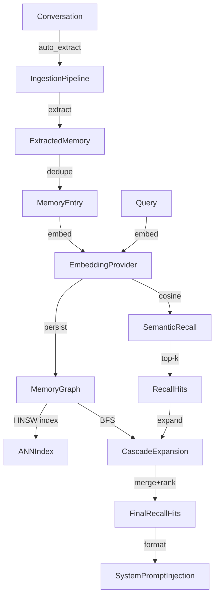

# Fox Agent SDK — Memory 设计 PRD

## 1. 概述

Fox Agent SDK 的 Memory 模块是一个完整的**语义长期记忆系统**，为 Agent 提供跨会话、跨任务的知识积累与召回能力。

### 1.1 设计目标

- **语义召回优先**：embedding 向量相似度驱动，支撑不同表达方式的语义匹配
- **图结构记忆**：以 MemoryGraph 组织记忆节点、标签、聚类、关系边，支持级联扩展召回
- **自动生命周期**：从对话转录到记忆写入、去重、冲突检测、embedding 生成全自动
- **治理与运维**：保留策略、大小限制、导入导出、重建索引、审计日志
- **域自适应兼容**：Memory 是领域无关的基础设施——coding 项目的代码习惯和量化项目的策略偏好共用同一套存储与召回体系。领域上下文通过 AGENTS.md 注入 system prompt（详见 Fox Agent SDK PRD §4.7.1 Domain Adaptation），Memory 层不感知具体领域

### 1.2 非目标

- 不实现分布式向量数据库（单机 HNSW + JSON 文件）
- 不依赖外部 SaaS memory service（本地向量 + 本地文件）
- 不自建复杂知识图谱推理引擎
- 不构建专用 Memory 管理 UI

### 1.3 核心用户故事

1. 作为一个终端用户，当我用不同方式表达同一件事时，Agent 应能召回之前的相关记忆。
2. 作为一个应用开发者，我可以让 Agent 自动从对话中学习用户偏好，无需手动操作。
3. 作为一个合规负责人，我可以删除、禁用、脱敏特定的记忆条目。
4. 作为一个测试工程师，Memory 的召回结果可回归验证。

---

## 2. 领域模型

### 2.1 核心领域概念



| 概念 | 类型 | 说明 |
|------|------|------|
| `MemoryEntry` | 实体 | 一条长期记忆（内容、类别、置信度、embedding） |
| `MemoryGraph` | 聚合 | 记忆图（记忆节点 + 标签 + 聚类 + 边 + 元数据） |
| `MemoryScope` | 值对象 | 作用域：Session（会话级，隔离）/ Project（项目级）/ Global（用户级）/ All |
| `RecallMode` | 值对象 | 召回策略：Recent / Keyword / Semantic / Cascade |
| `EmbeddingProvider` | 领域服务 | 文本向量化接口（默认：Mistral + HuggingFace/本地模型） |
| `RecallHit` | 值对象 | 单条召回结果（条目 + 分数 + 分项得分 + 来源） |
| `MemoryManager` | 领域服务 | 记忆系统的统一入口 |
| `MemoryInjection` | 值对象 | 注入 prompt 的计算结果 |
| `MemoryExtractor` | 领域服务 | 从对话转录中抽取候选记忆（LLM 驱动） |
| `MemoryRelevanceChecker` | 领域服务 | 验证候选记忆的相关性和冲突（LLM 驱动） |

### 2.2 MemoryEntry 结构

```
MemoryEntry
├── id: String                    # UUID v4
├── category: MemoryCategory      # Fact | Preference | Entity | Correction | Custom
├── content: String               # 记忆内容原文
├── tags: Vec<String>             # 标签列表
├── search_text: String           # 规范化搜索文本（自动生成）
├── created_at / updated_at       # 时间戳
├── access_count: u32             # 访问计数
├── source: Option<String>        # 来源（auto_extract / manual / promoted_from:session）
├── trust: TrustLevel             # High | Medium | Low
├── strength: u32                 # 强化次数
├── active: bool                  # 启用状态
├── superseded_by: Option<String> # 被取代的 ID
├── reinforcements: Vec<...>      # 强化面包屑
├── embedding: Option<Vec<f32>>   # 向量（384 维）
├── embedding_model: Option<String>     # 模型标识
├── embedding_version: Option<String>   # 模型版本
└── confidence: f32               # 置信度（0-1），支持时间衰减、访问加成
```

### 2.3 MemoryGraph 结构（v2）

```
MemoryGraph
├── graph_version: u32           # GRAPH_VERSION = 2
├── memories: HashMap<id, MemoryEntry>
├── tags: HashMap<tag_id, TagEntry>
├── clusters: HashMap<cluster_id, ClusterEntry>
├── edges: HashMap<source_id, Vec<Edge>>        # 出边
├── reverse_edges: HashMap<target_id, Vec<source_id>>  # 入边（懒更新）
└── metadata: GraphMetadata
    ├── last_cluster_update
    ├── last_embedding_rebuild_at
    ├── embedding_model / embedding_version
    ├── total_embeddings
    ├── retrieval_count
    └── link_discovery_count
```

### 2.4 EdgeKind 边类型

| 边类型 | 遍历权重 | 说明 |
|--------|---------|------|
| `HasTag` | 0.8 | 记忆 ↔ 标签 |
| `InCluster` | 0.6 | 记忆 ↔ 聚类 |
| `RelatesTo { weight }` | weight | 显式关系 |
| `Supersedes` | 0.9 | 新记忆取代旧记忆 |
| `Contradicts` | 0.3 | 矛盾标记 |
| `DerivedFrom` | 0.7 | 派生来源 |

---

## 3. 存储架构

### 3.1 持久化层

```
{storage_dir}/
├── sessions/
│   └── {session_id}.json    # 会话级 MemoryGraph（会话隔离，不跨 session 共享）
├── projects/
│   └── {hash}.json         # 项目级 MemoryGraph
│   └── {hash}.ann.bin      # HNSW 索引（可选）
├── global.json              # 全局 MemoryGraph
├── global.ann.bin           # HNSW 索引（可选）
├── models/                  # embedding 模型缓存
└── memory.audit.jsonl       # 审计日志（JSONL）
```

**作用域隔离模型**：

| 作用域 | 存储路径 | Key | 共享范围 |
|--------|---------|-----|---------|
| `Session` | `sessions/{session_id}.json` | session_id（已做路径安全净化）| 仅当前会话，会话间隔离 |
| `Project` | `projects/{hash}.json` | 工作目录哈希 | 同一项目目录的所有会话 |
| `Global` | `global.json` | 无 | 所有项目、所有会话 |

- **Session 作用域**用于任务态临时记忆、中间假设、草稿，避免污染跨会话召回。需通过 `with_session_id()` 绑定会话 ID
- **记忆提升**：Session 记忆可通过手动 `promote_memory()` 或自动提升（`auto_promote_enabled` + strength 阈值）沉淀到 Project/Global，避免有价值的知识随会话结束丢失。提升为单向：不能提升 INTO Session

- **存储格式**：MemoryGraph v2，HashMap-based JSON（清晰、可人工阅读）
- **缓存策略**：全局 LRU 缓存（`MemoryGraphCache`），减少重复 I/O
- **备份恢复**：写入前先写 `.tmp`，原子 rename。损坏文件自动回退 `.bak`
- **默认路径**：`$FOX_AGENT_DIR/memory/` → `$DATA_DIR/fox-agent/memory/` → `~/.fox-agent/memory/`

### 3.2 MemoryGraphCache（LRU）

```rust
// 缓存 key = 文件路径 abs
// 缓存条目 = MemoryGraph + last_access_time
// 最大容量：可配置，默认 128 条目
// 清理策略：LRU eviction
pub fn cache_graph(path: PathBuf, graph: &MemoryGraph) { ... }
pub fn cached_graph(path: &Path) -> Option<MemoryGraph> { ... }
pub fn invalidate_cache(path: &Path) { ... }
```

---

## 4. Embedding 链路

### 4.1 EmbeddingProvider trait

```rust
pub trait EmbeddingProvider: Send + Sync {
    fn model_name(&self) -> &str;         // 模型标识
    fn version(&self) -> &str;
    fn dimension(&self) -> Option<usize>; // 维度（OnceLock 延迟初始化）
    fn embed_batch(&self, inputs: &[String]) -> Result<Vec<Vec<f32>>, String>;
    fn embed_text(&self, input: &str) -> Result<Vec<f32>, String>;  // 默认 = embed_batch[0]
}
```

### 4.2 默认实现：MistralEmbeddingProvider

```
特性：
- 基于 mistralrs (Rust) 的本地 embedding 推理
- 专用后台线程 + 独立的 tokio single-thread runtime
- 通过 mpsc channel 接收请求，支持 batch

模型来源（优先级降序）：
1. embedding_model_path（本地目录） → 直接加载
2. auto_download_embedding_model = true → HuggingFace 下载
3. 以上均不可用 → embedding 未启用（回退 keyword）
```

### 4.3 Embedding 生命周期

```
MemoryEntry::new()  →  embedding = None
     │
     ▼
prepare_entry_for_storage()
     │
     ├── embed_text(content)
     │    ├── Ok(vec)  →  set_embedding_metadata(vec, model, version)
     │    └── Err      →  保留 keyword-only，记录 warning
     │
     ▼
save_graph()  →  更新 GraphMetadata.total_embeddings
```

### 4.4 FixedEmbeddingProvider（测试）

提供可控的 `|inputs| -> Vec<Vec<f32>>` 映射函数，支撑确定性测试。

---

## 5. 召回引擎

### 5.1 RecallMode 策略矩阵

| Mode | 种子来源 | 排序 | 需要 embedding |
|------|---------|------|---------------|
| **Recent** | 全部 active 记忆 | `recency × 0.85 + trust × 0.15` | 否 |
| **Keyword** | `search_text` 关键词匹配 | `keyword × 0.65 + recency × 0.2 + trust × 0.15` | 否 |
| **Semantic** | cosine similarity（全量或 ANN） | `cosine × 0.7 + recency × 0.15 + trust × 0.15` | 是 |
| **Cascade** | Semantic/Keyword top-k(×2) → graph BFS | seed score + graph score + recency + trust | 阶梯式 |

### 5.2 Semantic Recall 双路径

```
recall_semantic(query, limit)
  │
  ├── embedding_enabled = false  →  recall_keyword  （回退）
  │
  ├── embed(query) 失败          →  recall_keyword  （回退）
  │
  ├── ann_enabled && vectors ≥ ann_min_vectors
  │    └── recall_semantic_with_ann()
  │         ├── HNSW top-k(limit × multiplier)
  │         └── cosine exact scoring on candidates
  │
  └── 全量 cosine
       ├── 遍历所有 active 带 embedding 的条目
       ├── 过滤 cosine ≤ 0.0
       └── 结果为空  →  recall_keyword  （回退）
```

### 5.3 Cascade（级联扩展）

```
1. seeds = semantic_or_keyword(query, limit × 2)
2. seed_ids = seeds.map(id), seed_scores = seeds.map(score)
3. graph.cascade_retrieve(seed_ids, seed_scores, depth, limit × 3)
   └── BFS 遍历出边，衰减权重
4. merge(seeds + cascaded)，去重，取 max score
5. top_k(limit)
```

### 5.4 ANN 索引（HNSW）

```
索引文件：{graph_path}.ann.bin
引擎：vectorlite (Rust) — HNSW with Cosine
缓存：进程级 OnceLock<Mutex<HashMap<PathBuf, AnnSnapshot>>>
生命周期：
  - save_graph 时 invalidate（因数据可能变了）
  - rebuild_ann 手动重建
  - 首次 semantic recall 时惰性构建
  - 0 条 embedding 时自动删除索引文件
```

### 5.5 RecallHit 返回值

```rust
pub struct RecallHit {
    pub entry: MemoryEntry,
    pub score: f32,                      // 综合得分
    pub score_breakdown: ScoreBreakdown, // 分项得分
    pub retrieval_source: RetrievalSource, // 来源标识
}

pub struct ScoreBreakdown {
    pub semantic_score: Option<f32>,
    pub keyword_score: Option<f32>,
    pub recency_score: f32,
    pub graph_score: Option<f32>,
    pub trust_score: f32,
    pub final_score: f32,
}
```

---

## 6. Ingestion Pipeline（写入流水线）

### 6.1 完整流水线

```
Conversation Transcript
  │
  ▼
[1] MemoryExtractor::extract(transcript, existing_texts)
  │     → Vec<ExtractedMemory>              (LLM 抽取候选记忆)
  │
  ▼
[2] For each candidate (limited by auto_extract_max_items_per_turn):
  │
  ├── [2a] prepare_entry_for_storage  →  normalize + embed
  │
  ├── [2b] verify_relevance?
  │    └── MemoryRelevanceChecker::check_relevance → (bool, reason)
  │         ├── false → skipped_irrelevant++, continue
  │         └── true → 继续
  │
  ├── [2c] find_duplicate_for_ingestion
  │    ├── 候选匹配：同 category + 相似度 ≥ dedupe_similarity_threshold
  │    │   相似度 = semantic(cosine) || text_overlap(>2 char tokens)
  │    ├── 命中 → reinforce_memory(existing), skipped_duplicates++, continue
  │    └── 未命中 → 继续
  │
  ├── [2d] find_contradiction_for_ingestion
  │    ├── 候选：同 category + 文本不重叠 + embedding 相似
  │    └── MemoryRelevanceChecker::check_contradiction(new, existing)
  │         ├── 无冲突 → 继续写入
  │         └── 有冲突 → 写入后 apply_contradiction_policy
  │
  └── [2e] remember(candidate, scope)  →  写入 + 存盘
```

### 6.2 ContradictionPolicy 冲突策略

| 策略 | 行为 |
|------|------|
| `Ignore` | 两者共存，不做处理 |
| `Supersede` | 新记忆取代旧记忆（旧 marked inactive + superseded_by） |
| `DowngradeConfidence` | 旧记忆置信度衰减 `contradiction_confidence_decay` |
| `MarkContradictionEdge` | 创建双向 `Contradicts` 边 |

### 6.3 去重判断

```
duplicate_match(existing, candidate, threshold):
  1. searchable_text 完全相同 → true
  2. 两者都有 embedding：
     cosine_similarity(existing.embedding, candidate.embedding) ≥ threshold → true
  3. 任一方无 embedding：
     has_text_overlap(existing.content, candidate.content) → bool
     (至少一个 >2 char token 同时出现在两边)
```

### 6.4 记忆增强

```
reinforce(existing_id):
  - strength += 1
  - confidence = min(confidence + 0.05, 1.0)
  - 追加 Reinforcement 面包屑 (session_id, message_index, timestamp)
```

### 6.5 内存管理接口

```rust
// SDK 层 MemoryManager（fox-agent-sdk/src/memory.rs）
trigger_ingestion_for_turn(session_id, agent_model, memory_manager)
  ↓
CoreMemoryManager::ingest_transcript(transcript, extractor, checker)
```

触发条件：`auto_extract = true`，每轮结束后异步 `tokio::spawn`。

---

## 7. Memory Prompt 注入

### 7.1 注入管线

```
每个 Turn 开始前：

1. trigger_recall_for_next_turn()
   └── memory_manager.recall(query, limit, RecallMode::Semantic, All)
        └── 如果没有 embedding provider → RecallMode::Keyword

2. format_recall_hits_prompt(hits, max_chars, max_per_category)
   ├── 按 category 分组：corrections → facts → preferences → entities
   ├── 每组最多 max_per_category 条
   ├── 总字符数 ≤ max_chars
   └── 输出 Markdown 格式：## Category\n- content [source:trust]

3. 注入到 system prompt 的 dynamic_part
```

### 7.2 注入预算控制

| 参数 | 默认值 | 说明 |
|------|--------|------|
| `max_candidates` | — | 检索候选项上限 |
| `max_results` | — | 最终返回结果上限 |
| `injection_max_chars` | — | 注入 prompt 的最大字符数 |
| `injection_max_per_category` | — | 每类最多注入条数 |

---

## 8. 治理与运维

### 8.1 CRUD API

| 操作 | 方法 | 说明 |
|------|------|------|
| 写入 | `remember(entry, scope)` | 自动 embed + 持久化（scope 支持 Session/Project/Global）|
| 提升 | `promote_memory(id, from, to)` | 将记忆从一个作用域提升到更长生命周期的作用域（如 Session→Project）|
| 召回 | `recall(query, limit, mode, scope)` | 4 种策略 |
| 搜索 | `search(text, scope)` | 精确关键词搜索 |
| 列表 | `list(scope)` | 按更新时间排序 |
| 删除 | `forget(id)` | 从图中移除 |
| 禁用/启用 | `disable_memory(id)` / `enable_memory(id)` | 标记 active 字段 |
| 脱敏 | `redact_memory(id, replacement)` | 替换内容 + 重 embed |
| 统计 | `graph_stats()` | (memories, tags, edges, clusters) |
| 导出 | `export_to_path(scope, path)` | MemoryExportBundle JSON |
| 导入 | `import_from_path(path, merge)` | 替换或合并 |
| GC | `gc(max_age_hours)` | 清理过期 graph 文件 |
| 压缩 | `compact(scope, max_age_hours)` | 保留策略 + 大小限制 + GC |
| 重嵌 | `reembed(scope)` | 重建所有 embedding |
| 重索 | `reindex(scope)` | 重建所有 search_text |
| 聚簇刷新 | `refresh_clusters(scope)` | 按相似度重构聚类 |

### 8.2 保留策略

```
compact() 两步：

1. apply_retention_policy(graph)
   └── 删除 updated_at < Utc::now() - retention_days 的条目

2. apply_size_limit(graph)
   └── 超过 memory_size_limit → 删除低分条目（按 score + 时间排序）
```

### 8.3 模型变化自动重嵌

```
每次 semantic recall 前：

ensure_scope_embeddings_current(scope):
  if rebuild_on_model_change:
    if graph.embedding_model ≠ provider.model_name
    || graph.embedding_version ≠ provider.version
      → reembed_graph()  # 更新所有 embedding + 元数据
```

### 8.4 标签与聚类

```
tag_memory(id, tag_name):
  └── 创建/更新 TagEntry，添加 HasTag 边

link_memories(from_id, to_id, weight):
  └── 创建 RelatesTo 边

refresh_clusters(scope):
  └── 按 embedding cosine ≥ cluster_similarity_threshold 分组
      min_members ≤ cluster_min_members → 删除该 cluster
```

### 8.5 审计日志

```jsonl
{"timestamp":"2026-06-24T10:30:00Z","action":"forget","scope":"project","memory_id":"mem_xxx"}
{"timestamp":"2026-06-24T10:31:00Z","action":"redact","scope":"project","memory_id":"mem_xxx","details":{"before":"...","after":"[redacted]"}}
{"timestamp":"2026-06-24T10:32:00Z","action":"reembed","scope":"all","details":{"updated":42}}
```

所有变异操作自动追加到 `memory.audit.jsonl`。

---

## 9. MemoryConfig 完整配置

```rust
pub struct MemoryConfig {
    pub enabled: bool,                          // 总开关
    pub embedding_enabled: bool,                // 语义检索开关
    pub storage_dir: Option<PathBuf>,           // 存储根目录
    pub embedding_model_path: Option<PathBuf>,  // 本地模型路径
    pub embedding_model_id: String,             // HF model ID
    pub embedding_hf_endpoint: Option<String>,  // HF 镜像
    pub embedding_hf_token: Option<String>,     // HF token
    pub embedding_cache_dir: Option<PathBuf>,   // 模型缓存目录
    pub auto_download_embedding_model: bool,    // 自动下载模型
    pub ann_enabled: bool,                      // HNSW 加速
    pub ann_min_vectors: usize,                 // ANN 最低向量数
    pub ann_candidate_multiplier: usize,        // ANN 候选倍数
    pub max_candidates: usize,                  // 检索候选上限
    pub max_results: usize,                     // 召回结果上限
    pub injection_max_chars: usize,             // 注入字符上限
    pub injection_max_per_category: usize,      // 每类注入上限
    pub max_graph_depth: usize,                 // BFS 最大深度
    pub verify_relevance: bool,                 // LLM 相关性验证
    pub verify_model: Option<String>,            // 验证模型 ID
    pub auto_extract: bool,                     // 自动抽取
    pub auto_extract_scope: AutoExtractScope,    // 存储作用域（Session/Project/Global）
    pub auto_extract_message_window: usize,      // 抽取窗口
    pub auto_extract_max_items_per_turn: usize,  // 每轮最大抽取数
    pub auto_promote_enabled: bool,              // 启用 Session 记忆自动提升
    pub auto_promote_strength_threshold: u32,    // 提升阈值（strength ≥ 该值触发，默认 3）
    pub auto_promote_target: AutoExtractScope,   // 自动提升目标作用域（Project/Global）
    pub dedupe_similarity_threshold: f32,        // 去重相似度阈值
    pub cluster_similarity_threshold: f32,       // 聚类相似度阈值
    pub cluster_min_members: usize,              // 聚类最小成员
    pub contradiction_policy: ContradictionPolicy,
    pub contradiction_confidence_decay: f32,     // 冲突置信度衰减
    pub retention_days: Option<u64>,             // 保留天数
    pub memory_size_limit: Option<usize>,        // 最大条目数
    pub rebuild_on_model_change: bool,           // 模型变化自动重嵌
}
```

---

## 10. 测试体系

### 10.1 测试覆盖

| 测试 | 覆盖内容 |
|------|----------|
| `test_remember_and_recall` | 写入 → keyword 召回 |
| `test_search_and_forget` | 搜索 → 删除 → 确认不可召回 |
| `test_tag_and_link` | 标签、链接、关联查询 |
| `test_graph_stats` | 统计计数 |
| `test_semantic_recall_prefers_embedding_similarity` | semantic 召回优先级 |
| `test_recall_detailed_exposes_source_and_breakdown` | RecallHit 结构完整性 |
| `test_cascade_recall_surfaces_graph_hits` | Cascade 图扩展 |
| `test_reembed_populates_missing_embeddings` | 重嵌填充 |
| `test_ann_index_is_built_and_persisted_on_semantic_recall` | ANN 自动构建 |
| `test_rebuild_ann_creates_and_removes_sidecar` | ANN 重建/删除 |
| `test_export_and_import_roundtrip` | 导出导入完整性 |
| `test_import_bundle_merge` | 导入合并 |
| `test_import_bundle_replace` | 导入替换 |
| `test_disable_enable_and_redact_memory` | 启用/禁用/脱敏 + 审计 |
| `test_refresh_clusters_groups_similar_memories` | 聚类刷新 |
| `test_compact_applies_retention_and_size_limit` | 保留 + 大小限制 |
| `test_rebuild_on_model_change_reembeds` | 模型变化自动重嵌 |
| `test_regression_dataset_covers_keyword_semantic_and_cascade` | 三模式回归 |
| `session_memory_is_isolated_from_project` | Session 作用域隔离 |
| `manual_promote_moves_session_memory_to_project` | 手动提升 Session→Project + 溯源 |
| `promote_into_session_is_rejected` | 拒绝反向提升 INTO Session |
| `auto_promote_triggers_at_strength_threshold` | 强化达阈值自动提升 |
| `test_ingest_transcript_reinforces_duplicates` | 重复强化 |
| `test_ingest_transcript_marks_contradictions` | 冲突标记 |
| `test_ingest_transcript_skips_irrelevant_candidates` | 不相关过滤 |

### 10.2 测试基础设施

- `new_test()`：独立临时目录 + 无 embedding 的 MemoryManager
- `with_embedding_provider()`：注入 `FixedEmbeddingProvider`
- `with_ann_settings()`：注入 ANN 配置
- `StaticExtractor` / `StaticChecker`：确定性注入/验证

---

## 11. 子模块清单

| 文件 | 内容 |
|------|------|
| `mod.rs` | MemoryManager（主入口 + CRUD + ingest + recall + 治理）|
| `types.rs` | MemoryEntry, TrustLevel, MemoryCategory, MemoryScope, RecallMode, Reinforcement |
| `graph.rs` | MemoryGraph v2, Edge, EdgeKind, TagEntry, ClusterEntry, GraphMetadata, BFS cascade |
| `embedding.rs` | EmbeddingProvider trait, MistralEmbeddingProvider, FixedEmbeddingProvider, 模型下载 |
| `ann.rs` | HNSW 索引构建/搜索/缓存/持久化 |
| `ranking.rs` | top_k_by_score (BinaryHeap) |
| `relevance.rs` | MemoryExtractor, MemoryRelevanceChecker, ExtractedMemory |
| `prompt.rs` | 记忆格式化（prompt 注入 + 展示） |
| `storage.rs` | JSON 读写 + 备份恢复 + LRU 缓存 + GC |

### 11.1 SDK 层对接（fox-agent-sdk/src/memory.rs）

| 组件 | 功能 |
|------|------|
| `MemoryInjection` / `MemoryInjectionState` | Agent turn 间的注入状态机 |
| `trigger_recall_for_next_turn()` | 背景异步 semantic recall |
| `MemoryInjectionEvent` | 驱动状态转换的事件 |
| `model_for_memory_tasks()` | 为记忆任务 fork 模型实例 |
| `run_memory_prompt()` | 运行 LLM 抽取/验证 |
| `auto_extract` | 每轮后异步触发 ingestion pipeline |

---

## 12. 边界与约束

### 12.1 性能

- embedding 在专用后台线程独立 runtime 中执行，不阻塞主 Agent Loop
- JSON 文件使用 LRU 内存缓存，避免重复解析
- HNSW 索引惰性构建，自动缓存，数据变更时失效
- cosine similarity 全程 CPU（f32 × 384 维），无 GPU 依赖

### 12.2 降级策略

| 场景 | 行为 |
|------|------|
| embedding 未启用 | Semantic → fallback Keyword；Cascade → Keyword seeds |
| embed_text 失败 | 条目仍写入（keyword-only），记录 warning |
| query embedding 失败 | Semantic → fallback Keyword |
| ANN 搜索失败 | Semantic → 全量 cosine |
| JSON 文件损坏 | 自动回退 `.bak` 备份 |
| 备份也损坏 | 返回空 MemoryGraph（优雅降级，不 panic） |

### 12.3 安全性

- 所有变异操作记录审计日志
- `redact_memory` 支持内容替换 + 重嵌
- `disable_memory` 标记 inactive 但不删除
- `forget` 永久删除（不可逆）
- 无敏感信息主动进入记忆的检查机制（依赖上层脱敏）

### 12.4 域自适应（Domain Adaptation）

Memory 层是**完全领域无关**的基础设施。无论 Agent 在 coding、量化交易、数据分析还是运维场景下运行，Memory 都使用同一套存储、召回、去重、冲突检测逻辑。领域的语义差异由 system prompt 中的 AGENTS.md 注入处理（详见 Fox Agent SDK PRD §4.7.1），Memory 返回的结果被注入到 `dynamic_part`，与领域指令共同作用于 Agent 决策。

---

## 13. 典型用例

### 用户偏好记忆

```
会话 1: 用户说"我喜欢简洁的 Rust 代码"
  → auto_extract → MemoryEntry(category=Preference, "喜欢简洁 Rust", trust=High)

会话 2: 用户问"帮我写个排序函数"
  → semantic recall: "简洁 Rust" 与 query 语义相关
  → 注入到 system prompt
  → Agent 生成短小精悍的代码
```

### 知识纠正

```
会话 1: Agent 错误使用 serde_json::from_reader
  → auto_extract → MemoryEntry(category=Correction, "用 serde_json::from_str", trust=High)

会话 2: 类似场景
  → semantic recall 命中纠正
  → Agent 不再犯同样的错误
```

### 跨项目用户偏好

```
项目 A: 用户说"用 tabs 而不是 spaces"
  → remember_global() → 全局 memory

项目 B（不同目录）:
  → list(MemoryScope::Global) → 能读到 tabs 偏好
  → 注入 prompt
```

### 会话隔离与记忆提升

```
会话 A: "排查断连原因"（诊断任务）
  → remember(scope=Session) → sessions/{A}.json（任务态临时记忆）
  → 探索中记录的中间假设不会污染其他会话

会话 B: "重构支付模块"（并行任务）
  → recall(scope=Session) → 只召回会话 B 自己的记忆
  → 看不到会话 A 的诊断假设，避免任务干扰

有价值内容沉淀:
  → 手动: promote_memory(id, Session, Project)  → 显式提升到项目级
  → 自动: auto_promote_enabled=true 时，会话记忆被反复强化
          （strength ≥ auto_promote_strength_threshold）自动提升
  → 提升后记忆带 source="promoted_from:session"，可审计
```

### 运维清理

```rust
// 删除过期记忆（保留 90 天，最多存 1000 条）
let stats = memory_manager.compact(scope, 90 * 24).unwrap();
// stats.project_removed = 3, stats.global_removed = 1

// 导入之前导出的记忆
let stats = memory_manager.import_from_path(path, true).unwrap();

// 升级 embedding 模型后重嵌
let updated = memory_manager.reembed(MemoryScope::All).unwrap();
```
