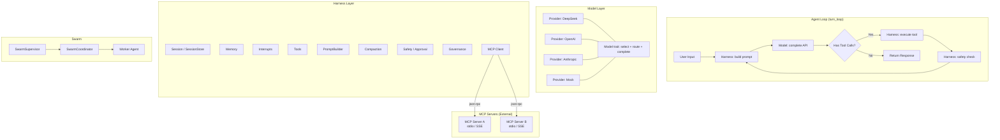
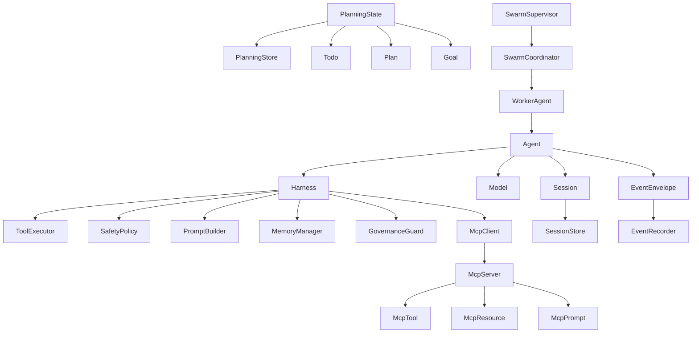
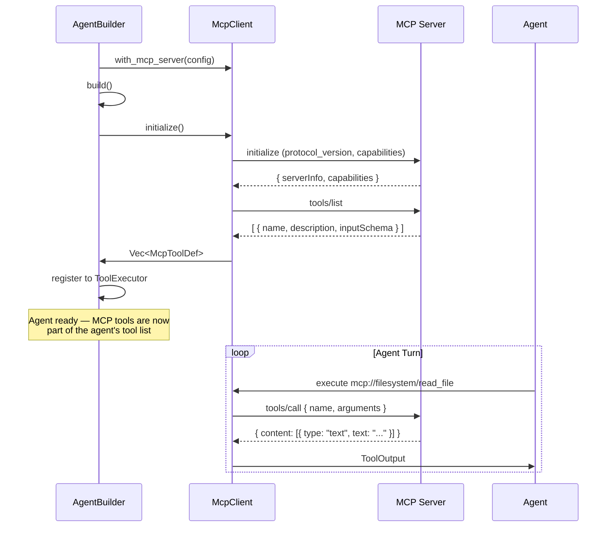
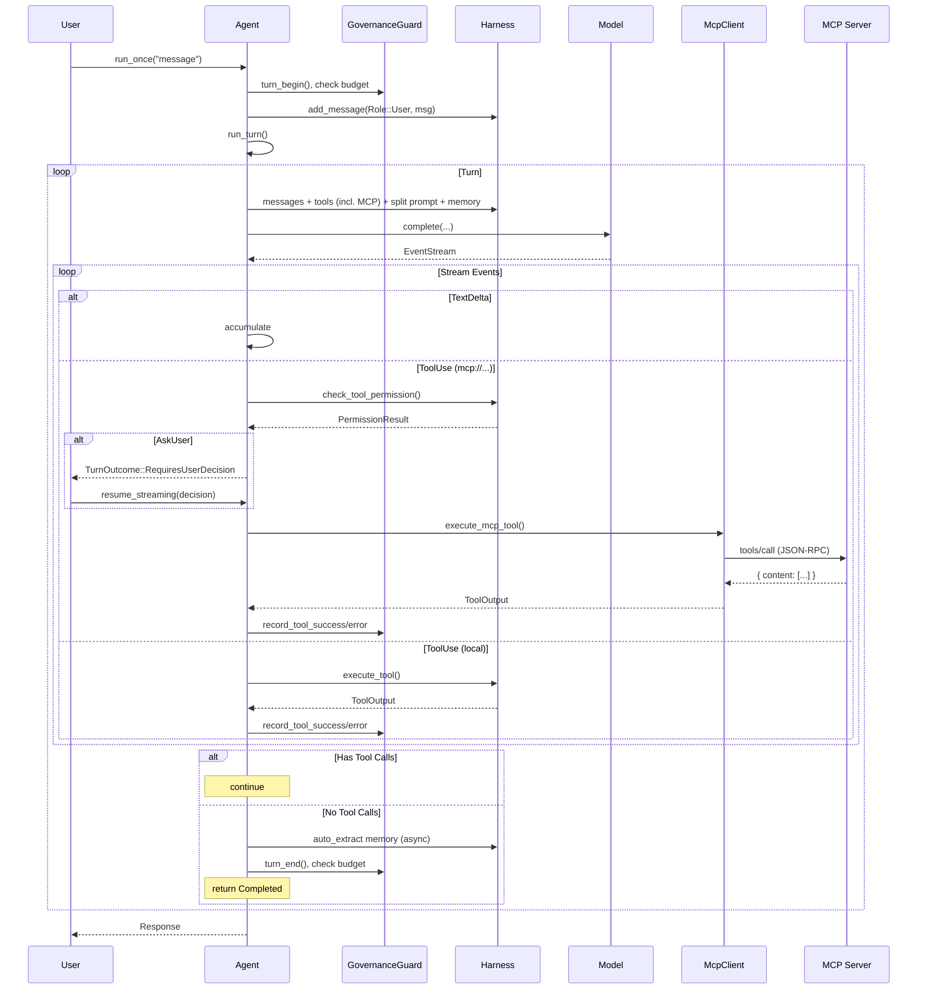

# Fox Agent SDK

## 1. 概述

Fox Agent SDK 是面向应用开发者的 Rust Agent SDK（crate 名: `fox-agent-sdk`）。核心理念为 **Agent = Model + Harness**：提供可嵌入任意应用的 Agent 运行内核，支持 Agent Loop、工具系统、记忆、权限审批、会话持久化、事件治理、Swarm 多智能体协作等完整产品化能力。

### 1.1 设计目标

- **无服务器依赖**：不需要 server、channel、bridge 等基础设施
- **纯 agent 核心**：只包含 agent 运行必需的组件
- **多 provider 切换**：model 层支持 DeepSeek / OpenAI / Anthropic / Mock
- **即插即用**：通过 `AgentBuilder` 在 30 行以内初始化完整 Agent
- **应用可落地**：会话持久化、权限审批、事件回放、运行治理、Swarm 产品化

### 1.2 用户角色

| 角色 | 描述 | 主要诉求 |
|---|---|---|
| SDK 接入开发者 | 将 Agent 嵌入 CLI、桌面端、服务端或业务系统的工程师 | 快速接入、低装配成本、稳定 API |
| 产品研发团队 | 基于 SDK 构建 AI Agent 应用的团队 | 可观测、可治理、可扩展 |
| 安全 / 合规负责人 | 关注工具调用、外部请求、数据访问边界 | 审批闭环、审计日志、权限策略 |
| 测试 / 质量工程师 | 验证 Agent 行为稳定性的角色 | 回放、Mock、确定性测试 |

### 1.3 核心用户故事

1. 作为应用开发者，我希望可以快速创建一个带默认能力的 Agent，而不是手工组装多个底层对象。
2. 作为产品团队，我希望 Agent 的会话、计划、目标和执行记录在应用重启后仍可恢复。
3. 作为安全负责人，我希望所有高风险工具操作都有可解释的审批策略和审计记录。
4. 作为测试工程师，我希望能回放一次真实会话，并稳定复现行为。
5. 作为多 Agent 应用开发者，我希望 worker 有明确状态、失败恢复和任务汇总能力。

### 1.4 整体架构



### 1.5 领域模型



### 1.6 能力范围与边界

#### SDK 提供

- **Agent Loop**：单轮/多轮执行（工具循环、软中断注入、最大迭代保护）、streaming 事件管道
- **LLM 抽象**：Provider/Model trait、流式事件统一、model fork（subagent 隔离）
- **工具系统**：Tool trait、注册/执行/校验、默认工具集（read/write/bash/grep/todo/plan/goal/memory）
- **会话持久化**：`SessionStore`（InMemory / File 实现）、自动快照、session 恢复
- **规划持久化**：`PlanningStore`（InMemory / File 实现）、todo/plan/goal 持久化
- **应用装配**：`AgentBuilder` / `SwarmRuntimeBuilder` 链式 API
- **事件治理**：`EventEnvelope`（7 个标准字段）、`EventRecorder`（JSONL 导出/回放）
- **权限审批**：`ApprovalManager`（3 层缓存：turn/session/workspace）、超时自动拒绝、审计日志
- **风险分级**：`RiskLevel`（Low/Medium/High/Critical）含 `policy_source` 可解释策略来源
- **运行治理**：`GovernanceGuard`（token/cost budget 强制执行）、metrics hooks
- **敏感信息脱敏**：`mask_secrets()` API key / JWT / PEM 自动脱敏
- **Swarm**：`SwarmSupervisor`（health check、retry、任务重分配、汇总报告）+ coordinator
- **MCP 集成**：`McpClient`（stdio / SSE 传输）、动态工具发现、资源/提示接入、权限集成
- **回放测试**：`ReplayRunner` golden transcript 验证、`MockProvider` 确定性测试
- **域自适应（Domain Adaptation）**：通过 AGENTS.md / Prompt Overlay / Planning Guidance 三层机制，让 Agent 自动适配不同业务领域（coding、量化交易、数据分析、运维等），无需修改 SDK 代码

#### SDK 不做

- 分布式/跨进程 Swarm 调度、UI 层、账号/密钥管理、应用级配置文件加载

### 1.7 Crate 拓扑

```text
fox-agent-sdk (Workspace)
 ├── fox-agent-core       # 核心类型、Trait、Event、Config
 ├── fox-agent-providers  # LLM 后端 (DeepSeek, OpenAI, Anthropic, Mock)
 ├── fox-agent-tools      # 内置工具集 (fs, bash, todo, plan, goal, memory)
 ├── fox-agent-mcp        # MCP 客户端（json-rpc、stdio/SSE、工具/资源发现）
 ├── fox-agent-swarm      # SwarmCoordinator, SwarmSupervisor
 └── fox-agent-sdk        # 主入口 (Agent, Harness, Builder, Governance, EventRecorder...)
```

---

## 2. 应用装配 — Builder API

`AgentBuilder` 和 `SwarmRuntimeBuilder` 提供链式、可发现的一站式初始化 API，替代手动组装 Provider + Model + Harness + Agent。

### 2.1 AgentBuilder

```rust
let mut agent = AgentBuilder::new()
    .provider_config(ProviderConfig::deepseek(api_key))  // 必选: provider
    .model_id("deepseek-v4-flash")                       // 可选: 模型
    .working_dir(".")                                    // 可选: 工作目录
    .with_default_tools()                                // 注册默认工具集
    .with_safety_policy(SafetyConfig::default())         // 可选: 安全策略
    .with_session_store(session_store)                   // 可选: 会话存储
    .with_planning_store(planning_store)                 // 可选: 规划存储
    .build()
    .await?;
```

**Builder 配置项**：

| 方法 | 说明 | 默认值 |
|------|------|--------|
| `provider_config(config)` | Provider 配置（DeepSeek/OpenAI/Anthropic） | 必选 |
| `with_provider(provider)` | 注入预构建的 Provider（覆盖 config） | — |
| `model_id(id)` | 模型 ID | `"gpt-4o"` |
| `working_dir(dir)` | 工作目录 | — |
| `sdk_config(cfg)` | 完整 SDK 配置 | `FoxAgentSdkConfig::default()` |
| `with_default_tools()` | 注册所有内置工具 | — |
| `with_tool(tool)` | 注册自定义工具 | — |
| `with_safety_policy(cfg)` | 安全/权限策略 | — |
| `with_session_store(store)` | Session 持久化 | 配置驱动 |
| `with_planning_store(store)` | Planning 持久化 | 配置驱动 |
| `with_sandbox(sandbox)` | 文件系统沙箱 | — |
| `with_permission_hook(hook)` | 自定义权限决策函数 | — |
| `with_mcp_server(config)` | 连接一个 MCP Server | — |
| `with_mcp_config(cfg)` | MCP 全局配置 | — |
| `build()` | 组装 Agent | — |
| `build_swarm_runtime()` | 组装 SwarmRuntime | — |

### 2.2 SwarmRuntimeBuilder

```rust
let runtime = SwarmRuntimeBuilder::new()
    .provider_config(ProviderConfig::deepseek(api_key))
    .model_id("deepseek-v4-flash")
    .coordinator(existing_coordinator)  // 可选: 复用已有 coordinator
    .build()
    .await?;
```

### 2.3 MCP 集成（Builder 视角）

```rust
let mut agent = AgentBuilder::new()
    .provider_config(ProviderConfig::deepseek(api_key))
    .model_id("deepseek-v4-flash")
    .with_default_tools()
    // 连接一个 stdio MCP server（本地进程）
    .with_mcp_server(McpServerConfig {
        name: "filesystem".into(),
        transport: McpTransport::Stdio {
            command: "npx".into(),
            args: vec!["-y", "@anthropic/mcp-server-filesystem", "/tmp"],
        },
        auto_approve: true,              // 自动审批该 server 的工具
    })
    // 连接一个 SSE MCP server（远程/本地 HTTP）
    .with_mcp_server(McpServerConfig {
        name: "database".into(),
        transport: McpTransport::Sse {
            url: "http://localhost:3001/sse".into(),
            headers: vec![("Authorization".into(), "Bearer token".into())],
        },
        auto_approve: false,             // 该 server 的工具需要审批
        tools_only: Some(vec!["query".into()]),  // 只暴露特定工具
    })
    .build()
    .await?;
```
MCP server 的工具在 `build()` 时自动发现并注册到 `ToolExecutor`，所有 `tools/list`、`tools/call` 协议交互对 Agent 透明。

---

## 3. Model 层设计

### 3.1 Provider trait

```rust
#[async_trait]
pub trait Provider: Send + Sync {
    async fn complete(
        &self, messages: &[Message], tools: &[ToolDefinition],
        system: &str, resume_session_id: Option<&str>,
    ) -> Result<EventStream>;

    async fn complete_split(
        &self, messages: &[Message], tools: &[ToolDefinition],
        system_static: &str, system_dynamic: &str,
        resume_session_id: Option<&str>,
    ) -> Result<EventStream>;

    fn name(&self) -> &str;
    fn model(&self) -> String;
    fn set_model(&self, model: &str) -> Result<()>;
    fn available_models(&self) -> Vec<&'static str>;
    fn model_routes(&self) -> Vec<ModelRoute>;
}
```

### 3.2 Model trait

```rust
#[async_trait]
pub trait Model: Send + Sync {
    async fn complete(
        &self, messages: &[Message], tools: &[ToolDefinition],
        system_static: &str, system_dynamic: &str,
        resume_session_id: Option<&str>,
    ) -> Result<EventStream>;

    fn name(&self) -> &str;
    fn model_id(&self) -> String;
    fn set_model(&self, model: &str) -> Result<()>;
    fn fork(&self) -> Arc<dyn Model>;
    fn runtime_state(&self) -> ModelRuntimeState;
    fn apply_state_event(&self, event: ModelStateEvent);
}
```

### 3.3 支持的 Provider

| Provider | `provider_name` | 构造方式 |
|----------|----------------|---------|
| DeepSeek | `deepseek` | `ProviderConfig::deepseek(key)` |
| OpenAI | `openai` | `ProviderConfig::new("openai", base_url, key)` |
| Anthropic | `anthropic` | `ProviderConfig::new("anthropic", base_url, key)` |
| Mock | N/A | `Arc::new(MockProvider::new("mock"))` |

---

## 4. Harness 层设计

### 4.1 Harness 实体结构

```rust
pub struct Harness {
    pub session_state: SessionState,
    pub tool_executor: ToolExecutor,
    pub memory_state: MemoryInjectionState,
    pub compaction_manager: CompactionManager,
    pub safety_system: SafetySystem,
    pub prompt_builder: PromptBuilder,
    pub skill_registry: Arc<RwLock<SkillRegistry>>,
    pub interrupt_manager: InterruptManager,
    // MCP 集成
    pub mcp_client: Option<McpClient>,
    // 持久化（产品化增强）
    pub session_store: Arc<dyn SessionStore>,
    pub planning_store: Arc<dyn PlanningStore>,
}
```

### 4.2 会话与状态持久化（产品化增强）

#### SessionStore

```rust
pub trait SessionStore: Send + Sync {
    fn save_snapshot(&self, snapshot: &SessionSnapshot) -> Result<(), String>;
    fn load_snapshot(&self, session_id: &str) -> Result<SessionSnapshot, String>;
    fn delete_snapshot(&self, session_id: &str) -> Result<(), String>;
    fn list_session_ids(&self) -> Result<Vec<String>, String>;
}
```

Session 快照包含：session_id、working_dir、messages、model runtime state、pending permission、interrupt state、metadata。

**默认实现**：
- `InMemorySessionStore` — 测试/轻量使用
- `FileSessionStore` — 生产环境文件持久化，支持 turn 结束后自动快照

#### PlanningStore

```rust
pub trait PlanningStore: Send + Sync {
    fn save_snapshot(&self, snapshot: &PlanningStateSnapshot) -> Result<(), String>;
    fn load_snapshot(&self, session_id: &str, scope: PlanningScope) -> Result<PlanningStateSnapshot, String>;
    fn list_session_ids(&self) -> Result<Vec<String>, String>;
    fn delete(&self, session_id: &str) -> Result<(), String>;
}
```

支持 session scope 与 global scope，版本号追踪，merge/replace/append checkpoint。

**默认实现**：`InMemoryPlanningStore` / `FilePlanningStore`

### 4.3 自动快照

```rust
let config = FoxAgentSdkConfig {
    session_storage_dir: Some(PathBuf::from("./sessions")),
    planning_storage_dir: Some(PathBuf::from("./planning")),
    auto_snapshot: true,  // 每轮结束后自动持久化
    ..Default::default()
};
```

### 4.4 Memory — 语义长期记忆系统

> 完整设计参见 **[memory_prd.md](./memory_prd.md)**。

Memory 模块是一个完整的语义长期记忆系统，核心能力：

| 能力 | 说明 |
|------|------|
| 语义召回 | embedding cosine similarity 驱动，支持 ANN (HNSW) 加速 |
| 图结构记忆 | MemoryGraph v2：记忆节点 + 标签 + 聚类 + 6 种关系边 |
| 四级召回 | Recent → Keyword → Semantic → Cascade（BFS 图扩展） |
| 自动 ingest | auto_extract：对话 → LLM 抽取 → 去重 → 冲突检测 → embed → 持久化 |
| 冲突策略 | Ignore / Supersede / DowngradeConfidence / MarkContradictionEdge |
| 提示注入 | 每轮 Semantic recall → 按 category 分组 → 预算截断 → dynamic_part |
| 治理运维 | 保留策略、大小限制、导入导出、reembed、reindex、聚簇刷新、审计日志 |
| 降级安全 | embedding 不可用时自动回退 keyword；文件损坏回退 .bak 备份 |

Memory Pipeline（异步，非阻塞主 turn）：
1. **Trigger** — turn N 收集上下文触发异步检索
2. **Search** — embedding + 相似度检索（ANN 加速）
3. **Cascade** — memory graph BFS 扩展候选集
4. **Verify** — 可选 sidecar 相关性验证
5. **Stage** — 结果写入 pending（turn N+1 消费）
6. **Inject** — turn N+1 注入到 system prompt（dynamic_part）

关键数据结构：

```rust
// MemoryEntry — 一条长期记忆
// 20+ 字段：content, embedding (384d), trust, confidence (时间衰减),
//            category, tags, source, reinforcements, superseded_by...
// 详见 memory_prd.md §2.2

// RecallHit — 召回结果
// score + score_breakdown (semantic/keyword/recency/graph/trust/final)
// + retrieval_source (Recent/Keyword/Semantic/SemanticAnn/CascadeSeed/CascadeGraph)
```

配置入口：`MemoryConfig`（30+ 字段），详见 [memory_prd.md §9](./memory_prd.md#9-memoryconfig-完整配置)。

### 4.5 Tools — 工具系统

```rust
#[async_trait]
pub trait Tool: Send + Sync {
    fn name(&self) -> &str;
    fn description(&self) -> &str;
    fn parameters_schema(&self) -> Value;
    async fn execute(&self, input: Value, ctx: ToolContext) -> Result<ToolOutput, ToolError>;
}
```

**内置工具**（`with_default_tools()`）：

| 工具 | 功能 | Sandbox 约束 |
|------|------|-------------|
| `read` | 读取文件 | 是 |
| `write` | 创建/覆写文件 | 是 |
| `edit` | 字符串替换编辑 | 是 |
| `bash` | 执行 shell 命令 | 是 |
| `grep` | 搜索文件内容 | 是 |
| `glob` | 按模式查找文件 | 是 |
| `todo` | 会话级任务列表 | — |
| `plan` | 共享计划管理 | — |
| `goal` | 目标追踪（含 checkpoint） | — |
| `memory` | 跨会话学习 | — |

### 4.6 Compaction — 上下文压缩

触发条件：`TokenBudget` / `Manual` / `TurnCount` / `ContextLimitApproaching`。

### 4.7 Prompt — System Prompt 构建

```
SplitPrompt
├── static_part: String   (可缓存: 模板 + skills 列表 + AGENTS.md)
├── dynamic_part: String  (每轮: 环境 + memory injection + planning context)
└── active_skill: String  (按需: 激活的 skill prompt，注入 dynamic_part)
```

> **注意**：skills 列表（名称+描述）注入 `static_part` 供 Agent 参考；skill 正文（prompt）仅在 Agent 通过 `skill(action="activate")` 激活后注入，不在启动时全量预加载。

`dynamic_part` 自动注入 planning context（todos、plan items、goals），由 `PlanningStore` 驱动。

### 4.7.1 Domain Adaptation — 域自适应机制

Fox Agent SDK 是**通用 Agent 运行时**，同一个 Agent 二进制可以在 coding、量化交易、数据分析、运维、文档写作等截然不同的领域工作。域自适应通过三层递进机制实现：

```text
┌─────────────────────────────────────────────────────┐
│                   Domain Adaptation                   │
│                                                       │
│  Layer 1: AGENTS.md (领域指令)                        │
│  ├── <work_dir>/AGENTS.md        (项目级领域规则)      │
│  └── ~/.fox-agent/AGENTS.md      (全局个人偏好)        │
│       → 注入到 static_part，可被 provider prefix-cache │
│       → 定义：角色、领域术语、数据源、策略、禁止项      │
│                                                       │
│  Layer 2: Prompt Overlay (覆盖层)                     │
│  ├── <work_dir>/.fox/prompt-overlay.md                │
│  └── ~/.fox-agent/prompt-overlay.md                   │
│       → 追加到 static_part 末尾，最高优先级            │
│       → 覆盖 system.md 中不适用于当前领域的指令         │
│                                                       │
│  Layer 3: Planning Guidance (system.md 内置)          │
│  └── system.md §Planning 段落 + §Domain Adaptation    │
│       → 指导 Agent 阅读 AGENTS.md 并自适应行为          │
│       → 显式要求 Agent "Read project instructions      │
│         (AGENTS.md, prompt-overlay.md) to understand the   │
│         current domain's conventions"                  │
│                                                       │
│  Layer 4: Skills (按需领域专业知识)                    │
│  └── .claude/skills/*.md   (Claude Code 兼容格式)      │
│       → Agent 通过 skill tool 按需激活                 │
│       → 激活后 prompt 注入 dynamic_part                │
│       → 详见 §4.9 Skills                               │
└─────────────────────────────────────────────────────┘
```

**不同领域的 AGENTS.md 示例**：

| 领域 | AGENTS.md 核心内容 |
|------|-------------------|
| **Coding** | "Use Rust. Follow idiomatic patterns. Write tests. Cache build artifacts." |
| **量化交易** | "You are a quantitative analyst. Data sources: CSV in ./data/. Use backtrader for backtesting. Never execute live trades without user confirmation." |
| **数据分析** | "Use Python + pandas. Data in ./datasets/. Output charts to ./reports/. Cite data sources." |
| **运维/SRE** | "Target cluster: k8s-prod. Read-only tools only. Alert on anomaly thresholds in ./config/alerts.yaml." |

**设计原则**：Agent 身份由领域定义，不由 SDK 硬编码。工具、Memory、规划体系都跨领域通用——唯一变化的是 `static_part` 中的领域指令和 `dynamic_part` 中的业务上下文。

### 4.8 MCP Protocol Support

> **状态**: 设计阶段，尚未实现。

[Model Context Protocol (MCP)](https://modelcontextprotocol.io) 是由 Anthropic 发布的开放协议，标准化了 LLM 应用与外部工具、数据源之间的通信方式。Fox Agent SDK 通过 `fox-agent-mcp` crate 提供 MCP 客户端能力，让 Agent 可以连接任意 MCP Server 并自动发现其提供的工具、资源和提示。

#### 4.8.1 设计目标

- **零侵入接入**：通过 Builder 一行配置即可连接 MCP Server，工具自动注册
- **双传输模式**：支持 stdio（本地子进程）和 SSE（HTTP 长连接）两种传输
- **权限可控**：MCP 工具纳入统一的 Safety / Approval 体系
- **动态发现**：`build()` 时自动执行 `tools/list`，运行时支持 `tools/list_changed` 增量更新
- **资源上下文**：`MCP Resource` 可注入到 system prompt 中，为模型提供外部知识
- **远程提示模板**：`MCP Prompt` 允许 Server 提供预定义的提示词模板

#### 4.8.2 协议交互流程



#### 4.8.3 McpClient 核心结构

```rust
/// MCP 客户端 — Agent 与 MCP Server 之间的桥梁。
pub struct McpClient {
    /// 已连接的 server 列表
    servers: Vec<Arc<McpServerHandle>>,
    /// 从 MCP tool_name 到本地 tool_id 的映射
    tool_map: HashMap<String, String>,
    /// 全局超时与重试策略
    config: McpConfig,
}

/// 单个 MCP Server 连接句柄。
struct McpServerHandle {
    name: String,
    transport: Box<dyn McpTransport>,
    /// auto_approve → 该 server 的工具默认 Allow
    auto_approve: bool,
    /// 空 = 暴露全部；非空 = 只暴露列表中的工具
    tools_only: Option<Vec<String>>,
    /// Server capabilities（initialize 后获取）
    capabilities: McpServerCapabilities,
}
```

#### 4.8.4 McpTransport 抽象

```rust
/// MCP 传输层抽象。每个 Server 使用一种传输方式。
#[async_trait]
pub trait McpTransport: Send + Sync {
    /// 发送 JSON-RPC 请求，返回原始 JSON 响应。
    async fn send(&self, request: McpRequest) -> Result<McpResponse, McpError>;

    /// 启动传输（建立连接、握手）。
    async fn start(&self) -> Result<(), McpError>;

    /// 健康检查。
    async fn ping(&self) -> Result<(), McpError>;
}
```

**stdio 传输**：

```rust
McpTransport::Stdio {
    command: "npx",           // 启动命令
    args: vec!["-y", "@anthropic/mcp-server-filesystem", "/tmp"],
    env: None,                // 可选环境变量
    cwd: None,                // 可选工作目录
}
```
- Agent `build()` 时启动子进程
- 通过 stdin/stdout 发送 JSON-RPC 请求/响应
- Agent drop 时自动终止子进程
- 支持自动重启（crash 时）

**SSE (Server-Sent Events) 传输**：

```rust
McpTransport::Sse {
    url: "http://localhost:3001/sse",
    headers: vec![("Authorization".into(), "Bearer xxx".into())],
    connect_timeout_secs: 30,
    request_timeout_secs: 60,
}
```
- 先 POST `/message` 建立 session
- 通过 SSE 端点接收服务器推送
- 支持重连与指数退避

#### 4.8.5 工具映射与命名

MCP Server 返回的工具名可能与内置工具冲突。SDK 使用 `mcp://` 前缀命名空间避免冲突：

```
MCP tool name        →  Agent tool name
─────────────────────────────────────────
filesystem/read_file →  mcp://filesystem/read_file
database/query       →  mcp://database/query
```

当 `tools_only` 过滤时，只有白名单中的工具被注册。

工具分类：
- `McpToolSchema` → `ToolDefinition` 的自动转换
- `inputSchema` (JSON Schema) → `parameters_schema` (保持原样)
- `description` 直接映射

#### 4.8.6 Resource 与 Prompt 集成

**Resource（资源）**：

MCP Server 可暴露文件、数据库表、API 端点等外部资源。SDK 将其注入到 system prompt 的 `dynamic_part`：

```rust
// 在 build_system_prompt_split 时：
let resources = mcp_client.list_resources().await;
for res in resources {
    if res.mime_type.starts_with("text/") {
        dynamic_part.push_str(&format!(
            "\n[MCP Resource: {}]\n{}\n",
            res.uri, res.text.unwrap_or_default()
        ));
    }
}
```

**Prompt（提示模板）**：

MCP Server 可提供预定义的提示词模板，通过 `list_prompts` / `get_prompt` 获取并注入。

#### 4.8.7 权限与审批集成

MCP 工具与内置工具共享同一套 Safety / Approval 体系：

| 配置项 | 说明 |
|--------|------|
| `auto_approve: true` | 该 server 全部工具默认 Allow |
| `auto_approve: false` | 该 server 的工具遵循 `SafetyConfig.default_policy` |
| `tools_only` | 白名单过滤（未列出的工具不暴露给 Agent） |
| `McpServerConfig.risk_level` | 覆盖该 server 工具的风险级别 |

```rust
McpServerConfig {
    name: "database".into(),
    transport: McpTransport::Sse { url: "...".into(), headers: vec![] },
    auto_approve: false,
    risk_level: Some(RiskLevel::Critical),  // 数据库操作默认高风险
    tools_only: Some(vec!["query".into()]), // 只暴露 query，不暴露 migrate/delete
}
```

MCP 工具调用会生成 `PermissionRequest`，`tool_name` 为 `mcp://server_name/tool_name`，`tool_summary` 自动从 tool description 生成。

#### 4.8.8 McpConfig 全局配置

```rust
pub struct McpConfig {
    /// 全局是否启用 MCP
    pub enabled: bool,

    /// 连接超时（秒）
    pub connect_timeout_secs: u64,

    /// 单次工具调用超时（秒）
    pub tool_timeout_secs: u64,

    /// 最大并发 MCP 工具调用
    pub max_concurrent_tools: usize,

    /// 自动刷新工具列表（检测 tools/list_changed）
    pub auto_refresh_tools: bool,

    /// 刷新间隔（秒），0 = 不自动刷新
    pub tool_refresh_interval_secs: u64,

    /// 最大重连次数（SSE 断开时）
    pub max_reconnect_attempts: u32,

    /// 重连退避（毫秒）
    pub reconnect_backoff_ms: u64,

    /// 默认 MCP server 风险级别
    pub default_risk_level: RiskLevel,

    /// 是否暴露 resources 到 system prompt
    pub expose_resources: bool,

    /// 单次注入的最大 resource 数量
    pub max_resources_per_injection: usize,
}
```

#### 4.8.9 错误处理与降级

| 场景 | 行为 |
|------|------|
| MCP Server 连接失败 | Agent 构建失败，返回 `AgentError::McpConnectError` |
| 单个 server 连接失败，但 `allow_partial_failure = true` | 跳过该 server，其他正常连接 |
| 工具调用超时 | 返回 `ToolError::Timeout`，不计入 server 状态 |
| MCP Server 崩溃（stdio） | 自动重启子进程，重建连接 |
| SSE 连接断开 | 指数退避重连（最多 `max_reconnect_attempts` 次） |
| `tools/list` 失败 | 该 server 不贡献任何工具 |
| 运行时新增工具（`tools/list_changed`） | 自动注册新工具到 ToolExecutor |

#### 4.8.10 子 crate 结构（fox-agent-mcp）

```
fox-agent-mcp/
├── Cargo.toml
└── src/
    ├── lib.rs              # pub mod client, transport, types
    ├── client.rs           # McpClient
    ├── transport.rs        # McpTransport trait + stdio + SSE 实现
    ├── types.rs            # McpRequest, McpResponse, McpToolSchema, McpResource...
    ├── json_rpc.rs         # JSON-RPC 2.0 编解码
    └── tool_adapter.rs     # McpToolSchema → ToolDefinition 转换
```

依赖：`serde_json`, `tokio`, `reqwest` (SSE), `serde`。不依赖 `fox-agent-core`（通过 `fox-agent-sdk` 适配层桥接）。

### 4.9 Skills — 按需技能注入

Skill 是 Agent 按需加载的领域专家知识模块，**完全兼容 Claude Code skill 格式**。与旧版"全部预加载到 system prompt"不同，新版采用**按需激活**机制：Agent 先看到可用 skills 列表，在需要时通过 tool call 激活特定 skill，避免 prompt 膨胀。

#### 4.9.1 设计原则

| 原则 | 说明 |
|------|------|
| **格式兼容 Claude Code** | YAML frontmatter + markdown body，拿来直接可用 |
| **按需激活** | Skill 不预注入 system prompt，由 Agent 通过 `skill` tool 按需激活 |
| **共享状态** | Skill 激活状态通过 `Arc<RwLock<Option<Skill>>>` 在 Agent / Builder / Tool / PromptBuilder 间共享 |

#### 4.9.2 文件格式（Claude Code 兼容）

```markdown
---
name: pdf
description: PDF manipulation expert
allowed-tools: [read, write, bash]
model: claude-sonnet-4-20250514
---

You are a PDF expert. When asked about PDF files:

## Instructions
1. First **read** the file to understand its structure.
2. Plan the changes before writing.
3. **validate** the output after writing.
```

**YAML Frontmatter 字段**：

| 字段 | 必需 | 说明 |
|------|------|------|
| `name` | 否 | 唯一名称。缺省使用文件名（不含 .md）。frontmatter 存在时优先于文件名 |
| `description` | 否 | 可读描述。缺省使用 `name` |
| `allowed-tools` | 否 | 允许使用的工具列表，如 `[read, write, bash]`。为空则无限制 |
| `model` | 否 | 要求使用的模型。Fox Agent SDK 保留该字段，不强制校验 |

#### 4.9.3 核心类型

```rust
/// Skill — 完全兼容 Claude Code skill 格式。
pub struct Skill {
    pub name: String,                    // 唯一标识
    pub description: String,             // 可读描述
    pub prompt: String,                  // 激活后注入的 prompt 片段
    pub allowed_tools: Vec<String>,      // 允许的工具列表
    pub model: Option<String>,           // 要求的模型（保留，不校验）
    pub base_directory: Option<String>,  // 加载目录
}

impl Skill {
    /// 从文件内容解析（支持 YAML frontmatter 和旧版格式）
    pub fn parse(name: impl Into<String>, content: &str) -> Result<Self, String>;

    /// 从 .md 文件加载
    pub fn from_file(name: impl Into<String>, path: &Path) -> Result<Self, String>;
}

/// 轻量级 YAML frontmatter 解析器（无外部依赖）
fn parse_frontmatter(text: &str) -> HashMap<String, String>;

/// Skill 注册表 — 按名称索引
pub struct SkillRegistry {
    skills: HashMap<String, Skill>,
}

impl SkillRegistry {
    pub fn load_from_dir(&mut self, dir: &Path) -> Result<usize, String>;
    pub fn load_from_working_dir(&mut self, working_dir: Option<&Path>) -> Result<usize, String>;
    pub fn list(&self) -> Vec<Skill>;
    pub fn get(&self, name: &str) -> Option<&Skill>;
}
```

#### 4.9.4 SkillTool — 按需激活机制

Skill 通过内置的 `skill` 工具实现按需激活：

```rust
/// Tool that lets the Agent manage skills on-demand.
pub struct SkillTool {
    registry: Arc<RwLock<SkillRegistry>>,
    active: Arc<RwLock<Option<Skill>>>,  // 共享激活状态
}
```

**Tool 接口**：

| action | 参数 | 行为 |
|--------|------|------|
| `list` | 无 | 列出所有可用 skills，激活的用 ★ 标记 |
| `activate` | `name: String` | 将指定 skill 的 prompt 写入共享状态，注入到后续 system prompt |
| `deactivate` | 无 | 清除当前激活的 skill |

**Agent 交互示例**：

```
Agent: skill(action="list")
  →   /pdf          — PDF manipulation expert
     ★ /trading     — Quantitative trading analyst

Agent: skill(action="activate", name="pdf")
  → Skill `/pdf` activated (1234 chars of expertise loaded).

[Next turn: agent's system prompt now includes skill prompt]
```

#### 4.9.5 Prompt 注入流程

```
Agent::turn_loop()
  │
  ├─ self.active_skill.read().await ───── 读取激活的 Skill
  │
  ├─ harness.build_system_prompt_split(memory, active_skill) ─────
  │     │
  │     ├─ static_part:  模板 + AGENTS.md + skills 列表*
  │     ├─ dynamic_part: memory + plan context
  │     └─ active_skill:  prompt 片段注入 dynamic_part（每轮可变）
  │
  └─ model.complete(prompt) ───── 发送给 LLM
```

\* `skills 列表` 是 skills 的名称/描述信息（轻量），不是 prompt 正文。只有激活的 skill 的 prompt 正文才注入。

#### 4.9.6 Builder 装配

```rust
AgentBuilder::new()
    .with_default_tools()    // 自动：
    .build()                 // ① 从 .claude/skills/ 加载 skills
    .await?;                 // ② 注册 SkillTool（共享 registry + active handle）
                             // ③ Agent::new() 接收 active_skill handle
```

- 加载路径：`<working_dir>/.claude/skills/*.md`
- 使用 `with_default_tools()` 时自动启用

---

## 5. Agent Loop — 核心运行循环

```rust
pub struct Agent {
    model: Arc<dyn Model>,
    harness: Harness,
    pending_permission: Option<PermissionRequest>,
    governance: Option<GovernanceGuard>,
}

impl Agent {
    pub async fn run_once(&mut self, user_message: &str) -> Result<TurnOutcome, AgentError>;
    pub async fn run_once_streaming(
        &mut self, user_message: &str, event_tx: &AgentEventTx,
    ) -> Result<TurnOutcome, AgentError>;
    pub async fn resume_streaming(
        &mut self, decision: PermissionDecision, event_tx: &AgentEventTx,
    ) -> Result<TurnOutcome, AgentError>;
}
```

### 5.1 Agent Loop 流程图



---

## 6. 事件治理与回放

### 6.1 EventEnvelope

在 `AgentEvent` 之上提供稳定的对外事件信封，用于 UI、日志、审计、回放：

```rust
pub struct EventEnvelope {
    pub event_id: String,         // UUID v4
    pub session_id: String,
    pub turn_id: u64,
    pub seq: u64,                 // 事件序号
    pub timestamp: u64,           // Unix 秒
    pub trace_id: String,
    pub parent_event_id: Option<String>,
    pub source: String,           // "agent" | "tool" | "system"
    pub payload: EnvelopePayload, // 序列化后的事件体
}
```

### 6.2 AgentEvent（内部事件）

```rust
pub enum AgentEvent {
    TurnStart { turn_id: u64 },
    TurnEnd { turn_id: u64, outcome: TurnOutcome },

    ModelTextDelta { text: String },
    ModelThinkingDelta { text: String },
    ModelUsage { usage: TokenUsage },

    ToolCallStart { call_id: String, name: String, input: Value },
    ToolCallEnd { call_id: String, name: String, output: ToolOutput },

    PermissionRequest { request: PermissionRequest },

    Compaction { event: CompactionEvent },
    MemoryStateChanged { event: MemoryStateEvent },
    SoftInterruptInjected { interrupt: InjectedInterrupt },
    McpServerConnected { server_name: String },
    McpServerDisconnected { server_name: String, error: Option<String> },

    Error { error: AgentError },
}
```

### 6.3 EventRecorder

JSONL 导出与回放：

```rust
let recorder = EventRecorder::new("session-1", 1);
let (tx, rx) = mpsc::channel(64);

// 启动录制
tokio::spawn(recorder.clone().run(rx, Some(PathBuf::from("trace.jsonl"))));

// 导出（自动脱敏）
recorder.export_to_file(PathBuf::from("events.jsonl")).await.unwrap();

// 重放
let envelopes = EventRecorder::load_from_file(&PathBuf::from("events.jsonl")).unwrap();
```

### 6.4 ReplayRunner

Golden transcript 回归测试：

```rust
let runner = ReplayRunner::from_file(&PathBuf::from("golden.jsonl")).unwrap();
let passes = runner.check_event_types(&[
    "TurnStart", "ModelTextDelta", "ToolCallStart", "ModelTextDelta", "TurnEnd"
]);
assert!(passes);
```

### 6.5 敏感信息脱敏

```rust
let safe = mask_secrets(
    "curl -H 'Authorization: Bearer eyJhbG...' https://api.example.com"
);
// → "curl -H 'Authorization: Bearer [JWT]' https://api.example.com"
```

脱敏模式：API keys（`sk-...`）、JWT tokens、`Authorization:` / `x-api-key:` headers、`password=` / `token=` assignments、PEM private keys。

---

## 7. 权限审批工作流

### 7.1 PermissionRequest

```rust
pub struct PermissionRequest {
    pub request_id: String,
    pub tool_name: String,
    pub prompt: String,
    pub risk_level: RiskLevel,       // Low | Medium | High | Critical
    pub expires_at: Option<u64>,     // Unix 超时时间戳
    pub policy_source: String,       // "denylist" | "allowlist" | "default:confirm"
    pub tool_summary: String,        // 工具动作摘要
}
```

### 7.2 Safety 策略

```rust
let safety = SafetyConfig {
    default_policy: DefaultSafetyPolicy::Confirm,  // Allow | Deny | Confirm
    tool_denylist: Some(vec!["bash".into()]),       // 永远拒绝
    tool_allowlist: Some(vec!["read".into()]),       // 永远允许
    ..Default::default()
};
```

### 7.3 中断-恢复流程

当 agent 遇到需要用户审批的工具调用时：

1. `run_once_streaming` 返回 `TurnOutcome::RequiresUserDecision { request }`
2. 应用层展示 `request.prompt`、`request.risk_level`、`request.policy_source`
3. 用户做出决策（Allow/Deny）
4. 调用 `agent.resume_streaming(decision, event_tx)` 继续执行

### 7.4 ApprovalManager — 审批缓存与审计

```rust
let approval = ApprovalManager::new("session-001", safety_config);

// 三层缓存
approval.cache_decision("read", &PermissionResult::Allow, ApprovalScope::ThisSession).await;

// 检查缓存命中
let cached = approval.check_cache("read").await;

// 审计记录
approval.record_audit(&request, &PermissionResult::Allow, turn_number).await;
```

| 缓存范围 | 生命周期 |
|---------|---------|
| `ThisTurn` | 当前 turn 结束后清除 |
| `ThisSession` | 跨 turn 持久 |
| `ThisWorkspace` | 跨 session 重启持久 |

无审批超时：等待用户审批决策的请求永不超时，会一直保持挂起，直到用户显式允许或拒绝。

---

## 8. 运行治理与观测

### 8.1 BudgetConfig

```rust
pub struct BudgetConfig {
    pub token_budget: Option<u64>,          // session 最大 token
    pub cost_budget_cents: Option<u64>,     // session 最大费用（美分）
    pub provider_timeout_secs: u64,         // Provider HTTP 超时
    pub provider_retries: u32,              // 瞬时错误重试次数
    pub tool_timeout_secs: u64,             // 单次工具超时
    pub tool_concurrency_limit: usize,      // 最大并行工具调用
    pub max_turns: u64,                     // session 最大轮次（0 = 无限）
}
```

### 8.2 GovernanceGuard

```rust
let guard = GovernanceGuard::new(BudgetConfig {
    token_budget: Some(1_000_000),
    cost_budget_cents: Some(5000),
    ..Default::default()
});

// 注册 metrics 回调
guard.add_metrics_hook(|snap: &MetricsSnapshot| {
    println!("tokens={} cost={}c errors={:.1}%",
        snap.total_tokens, snap.estimated_cost_cents,
        snap.tool_error_rate() * 100.0);
}).await;

// 接入 agent
agent.set_governance(Some(guard));
```

### 8.3 MetricsSnapshot

```rust
pub struct MetricsSnapshot {
    pub total_tokens: u64,
    pub total_input_tokens: u64,
    pub total_output_tokens: u64,
    pub estimated_cost_cents: u64,
    pub tool_calls: u64,
    pub tool_success_count: u64,
    pub tool_error_count: u64,
    pub compaction_count: u64,
    pub turns_completed: u64,
    pub total_latency_ms: u64,
}
```

---

## 9. Swarm 多智能体

### 9.1 架构

```
SwarmSupervisor
├── SwarmCoordinator
│   ├── plan: Vec<PlanItem>   (共享任务列表)
│   └── workers: HashMap<id, WorkerHandle>
│
├── RetryPolicy               (重试策略)
├── retry_states              (重试状态追踪)
└── reassignments             (任务重分配计数)
```

### 9.2 Worker 生命周期

```
Ready → Running → Completed
           ↓           Failed → [Retry] → Running
           ↓           TimedOut → [Reassign] → Running
           ↓
        Blocked (等待依赖)
```

### 9.3 SwarmSupervisor

在 `SwarmCoordinator` 之上提供产品化能力：

| 功能 | 说明 |
|------|------|
| **Health check** | 监控运行中的 worker，检测超时/僵死 |
| **Retry** | 失败任务自动重试，可配置 `max_retries` + `backoff_ms` |
| **Reassignment** | 重试耗尽后将任务转派给其他 worker |
| **Timeout** | 通过 `started_at_secs` 检测超时任务 |
| **Summary Report** | 所有 worker 完成后生成 `SwarmSummaryReport` |

```rust
let coordinator = Arc::new(SwarmCoordinator::new());
let supervisor = SwarmSupervisor::new(coordinator.clone(), RetryPolicy {
    max_retries: 3,
    backoff_ms: 1000,
    timeout_secs: 300,
    reassign_on_exhaust: true,
});

// 创建任务
coordinator.upsert_plan(vec![
    PlanItem {
        id: "t1".into(),
        content: "Research".into(),
        status: PlanStatus::Pending,
        priority: PlanPriority::High,
        assigned_to: Some("worker-1".into()),
        blocked_by: vec![],
    },
]);

// 汇总报告
let report = supervisor.generate_summary().await;
```

---

## 10. 配置入口（Config-first）

```rust
pub struct FoxAgentSdkConfig {
    pub memory: MemoryConfig,
    pub compaction: CompactionConfig,
    pub safety: SafetyConfig,
    pub mcp: McpConfig,                            // MCP 集成
    pub session_storage_dir: Option<PathBuf>,      // session 持久化目录
    pub planning_storage_dir: Option<PathBuf>,     // planning 持久化目录
    pub auto_snapshot: bool,                        // turn 后自动快照
    pub budget: BudgetConfig,                       // 运行治理
}
```

---

## 11. 典型使用示例

### 单 Agent（Builder API，3 行）

```rust
let mut agent = AgentBuilder::new()
    .provider_config(ProviderConfig::deepseek(api_key))
    .model_id("deepseek-v4-flash")
    .with_default_tools()
    .build()
    .await?;

let outcome = agent.run_once("What files are here?").await?;
```

### 自定义工具

```rust
builder.with_tool(Arc::new(WeatherTool));
```

### Swarm

```rust
let runtime = SwarmRuntimeBuilder::new()
    .provider_config(ProviderConfig::deepseek(key))
    .build()
    .await?;
```

完整示例参见：
- `examples/simple_agent.rs` — 单 Agent CLI（含 streaming 事件处理）
- `examples/non_coding_agent.rs` — 通用 Agent（客服机器人，自定义 system prompt + 领域工具）
- `examples/permission_flow.rs` — 权限审批流、审批缓存、审计
- `examples/swarm_workflow.rs` — Swarm 多 Agent 编排
- `examples/custom_tool.rs` — 自定义工具注册
- `examples/mcp_integration.rs` — MCP 集成（连接外部 MCP Server）
- `examples/multi_provider.rs` — 多 Provider 切换

---

## 12. 开发计划

### 12.1 里程碑

| 里程碑 | 目标 | 主要交付 |
|---|---|---|
| M1 | 补齐状态闭环 | `SessionStore`、`PlanningStore`、`InMemory`/`File` 实现、自动快照 |
| M2 | 降低接入门槛 | `AgentBuilder`、`SwarmRuntimeBuilder`、默认装配策略 |
| M3 | 完善应用治理 | `EventEnvelope`、`EventRecorder`、`ApprovalManager`（缓存/超时/审计） |
| M4 | 强化协作与测试 | `GovernanceGuard`（budget/metrics）、`SwarmSupervisor`、`ReplayRunner`、Examples |
| M5 | 权限增强 | `PermissionRequest` 扩展（risk_level、policy_source、tool_summary、expires_at） |
| M6 | 治理增强 | `MetricsSnapshot` 扩展（tool_error_count、compaction_count）、`GovernanceGuard` 接线 |
| M7 | MCP 集成 | `McpClient`、stdio/SSE 传输、工具自动发现、权限集成、Resource/Prompt 注入 |
| NFR | 安全 | 敏感信息脱敏（`scrub` 模块）、策略可解释性 |

### 12.2 任务拆解

| 编号 | 任务 | 状态 |
|---|---|---|
| T1 | `SessionStore` trait + `InMemory`/`File` 实现 | 已完成 |
| T2 | `PlanningStore` trait + todo/plan/goal 改造 | 已完成 |
| T3 | `AgentBuilder` + `SwarmRuntimeBuilder` | 已完成 |
| T4 | `EventEnvelope` + `EventRecorder` | 已完成 |
| T5 | `PermissionRequest` 扩展（risk_level 等） | 已完成 |
| T6 | `ApprovalManager`（缓存/超时/审计） | 已完成 |
| T7 | `GovernanceGuard` + budget/metrics | 已完成 |
| T8 | `SwarmSupervisor` + retry/reassign/timeout | 已完成 |
| T9 | `ReplayRunner` + golden transcript | 已完成 |
| T10 | Examples + 测试模板 | 已完成 |
| T11 | `McpTransport` trait + stdio/SSE 实现 | 已实现（stdio + SSE 双传输） |
| T12 | `McpClient` + Builder 集成 + 权限适配 | 已实现（含 resources/prompts 注入） |

---

## 13. 验收标准

### 13.1 全局验收

| # | 标准 | 状态 |
|---|------|------|
| AC1 | 应用方可通过 Builder 在 30 行内完成 Agent 初始化 | 通过 |
| AC2 | Agent 会话、规划状态支持持久化恢复 | 通过 |
| AC3 | 事件可用于 UI、日志、审计和回放 | 通过 |
| AC4 | 权限审批支持会话级缓存、超时和可解释来源 | 通过 |
| AC5 | Swarm 支持失败处理与汇总 | 通过 |
| AC6 | examples 覆盖单 Agent、权限流、Swarm 三类核心场景 | 通过 |
| AC7 | Agent 可通过 Builder 连接 MCP Server，自动发现并注册工具 | 待实现 |
| AC8 | MCP 工具调用纳入 Safety/Approval 体系 | 待实现 |
| AC9 | MCP Resource 可注入到 system prompt 作为上下文 | 待实现 |

### 13.2 验收用例

**会话恢复**：Given 运行中的 session → When 保存并重启 → Then 消息历史、模型状态恢复一致。

**审批缓存**：Given 用户对某工具选择"本会话允许" → When 同会话再次调用 → Then SDK 不再生成 AskUser 事件。

**事件回放**：Given 完整事件流 → When 导出并重放 → Then turn 顺序、tool 执行正确恢复。

**Swarm 失败重分配**：Given worker 任务失败 → When supervisor 启用 retry → Then 任务重试或转派。

**预算超限**：Given token/cost 超过 budget → When agent 继续运行 → Then 返回 `AgentError::BudgetExceeded`。

**MCP 工具发现**：Given 一个 MCP Server 提供 3 个工具 → When Agent build() 完成 → Then `tools/list` 被调用且 3 个 `mcp://` 工具注册到 ToolExecutor。

**MCP 权限审批**：Given MCP Server 非 auto_approve 且 `default_policy = Confirm` → When Agent 调用 MCP 工具 → Then 生成 `PermissionRequest` 并中断等待用户决策。

---

## 14. 非功能需求

### 14.1 性能

- Session/Planning 存储满足单机低并发场景
- 单轮状态快照不显著阻塞主 Agent Loop
- Memory 检索/验证异步不阻塞主 turn
- EventRecorder 支持异步写入

### 14.2 安全

- 权限审批支持策略可解释性（`policy_source`）
- 默认工具受 sandbox 约束（文件路径限制、bash 隔离）
- 事件/日志导出自动脱敏（`mask_secrets`）
- SDK 不内置 UI，不直接执行高风险动作

### 14.3 可用性

- 核心 API 简洁，Builder 优先于底层细碎装配
- 默认实现开箱即用（`InMemory` stores, `Allow` safety, 无 budget）
- 关键扩展点可替换（custom Provider/Tool/Safety/Store）

### 14.4 可测试性

- 所有存储接口提供内存实现（`InMemorySessionStore`、`InMemoryPlanningStore`）
- `MockProvider` 支持脚本化确定性测试
- `ReplayRunner` 支持 golden transcript 回归测试
- Agent Loop 最大迭代次数保护

---

## 15. 目录结构

```
fox-agent-sdk/
├── Cargo.toml
│
├── crates/
│   ├── fox-agent-core/        # 核心类型、Trait、Event、Config
│   ├── fox-agent-providers/   # DeepSeek, OpenAI, Anthropic, Mock
│   ├── fox-agent-tools/       # read, write, bash, grep, todo, plan, goal, memory
│   ├── fox-agent-mcp/          # McpClient, McpTransport (stdio + SSE), 工具发现
│   ├── fox-agent-swarm/        # SwarmCoordinator, SwarmSupervisor
│   └── fox-agent-sdk/         # Agent, Harness, Builder, EventRecorder, Governance...
│       ├── src/
│       │   ├── agent.rs            # Agent 核心 + turn loop
│       │   ├── builder.rs          # AgentBuilder, SwarmRuntimeBuilder
│       │   ├── harness.rs          # Harness 实体
│       │   ├── event_recorder.rs   # EventRecorder (JSONL)
│       │   ├── approval_manager.rs # ApprovalManager (缓存/超时/审计)
│       │   ├── governance.rs       # GovernanceGuard, BudgetConfig
│       │   ├── replay_runner.rs    # ReplayRunner (golden transcript)
│       │   ├── scrub.rs            # 敏感信息脱敏
│       │   ├── memory.rs           # Memory pipeline
│       │   ├── safety.rs           # SafetySystem
│       │   ├── compaction.rs       # CompactionManager
│       │   ├── prompt_builder.rs   # PromptBuilder
│       │   ├── session.rs          # SessionState
│       │   ├── swarm_runtime.rs    # SwarmRuntime
│       │   ├── mcp.rs              # MCP 集成适配层
│       │   └── tests.rs            # 集成测试 (39 tests)
│
├── examples/
│   ├── simple_agent.rs         # 单 Agent CLI
│   ├── permission_flow.rs      # 权限审批流
│   ├── swarm_workflow.rs       # Swarm 多 Agent
│   ├── non_coding_agent.rs    # 通用 Agent（客服机器人，自定义 system prompt + 领域工具）
│   ├── custom_tool.rs          # 自定义工具注册
│   ├── mcp_integration.rs      # MCP 集成（连接外部 MCP Server）
│
│   └── multi_provider.rs       # 多 Provider 切换
│
├── docs/
│   ├── prd.md                                   # 本文档（主 PRD）
│   ├── memory_prd.md                            # Memory 详细设计 PRD
│   └── application-developer-guide.md           # 应用开发者使用指南
│
└── README.md
```

---

## 16. 关键设计决策

- **Agent = Model + Harness**：实体组合而非接口组合，降低抽象复杂度
- **Reducer 模式**：状态变更通过 `Event → apply() → Change` 单向流动
- **Split System Prompt**：`static_part`（可缓存）+ `dynamic_part`（planning/memory injection）
- **Builder 优先**：`AgentBuilder` 链式 API > 手动组装 Provider/Model/Harness
- **异步非阻塞**：Memory 检索、auto_extract 不阻塞主 turn
- **配置集中**：`FoxAgentSdkConfig` 为唯一行为来源；SDK 不读取环境变量
- **MCP 透明集成**：`mcp://` 前缀命名空间隔离外部工具，纳入统一 Safety 体系，传输层与 Agent 解耦
