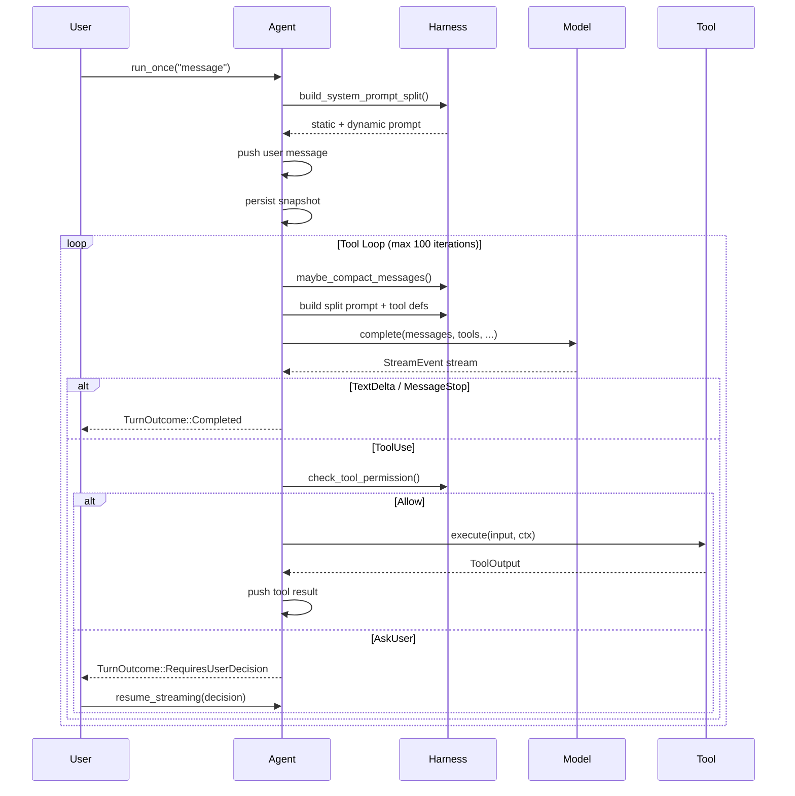
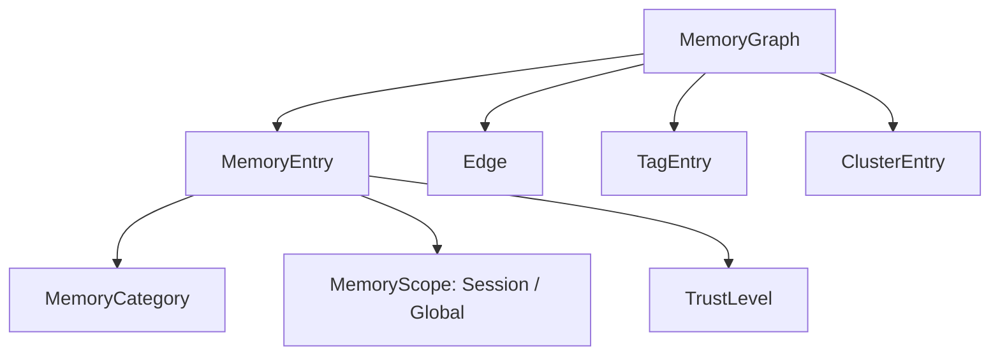
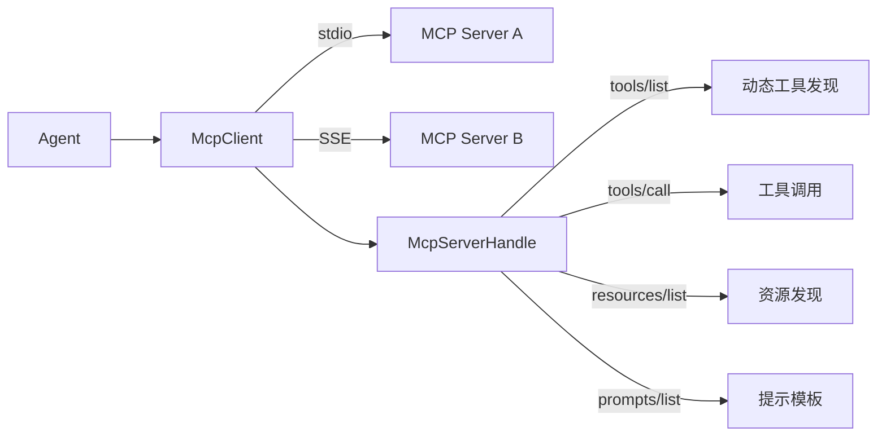

# Fox Agent SDK 技术白皮书

> 版本：0.1.0 | 语言：Rust（2024 Edition） | 协议：MIT OR Apache-2.0

---

## 1. 引言

Fox Agent SDK 是一个面向应用开发者的 Rust Agent 运行时框架。它以 **"Agent = Model + Harness"** 为核心设计哲学，将 LLM 调用、工具执行、会话持久化、权限审批、运行治理、多智能体协作等企业级能力封装为可嵌入的 SDK，无需独立服务进程，无需 gRPC/HTTP 桥接，可直接集成进 CLI 工具、桌面应用、后端服务或边缘设备。

### 1.1 设计目标

| 目标 | 说明 |
|------|------|
| **零基础设施依赖** | 不依赖 server / channel / bridge，纯 library 形态 |
| **多 Provider 切换** | 同一套 API 无缝切换 DeepSeek / OpenAI / Anthropic / Mock |
| **即插即用** | `AgentBuilder` 30 行以内完成 Agent 装配 |
| **生产可落地** | 会话持久化、权限审计、事件回放、预算治理、Swarm 协作 |
| **可测试** | MockProvider 确定性测试、ReplayRunner 黄金转录回放 |

### 1.2 适用场景

- AI Coding Agent（代码生成、重构、审查）
- 企业内部知识助手（RAG + 工具调用）
- 自动化运维 Agent（Shell 执行、文件操作）
- 多 Agent 协作系统（研究-编码-审查流水线）
- 量化交易 / 数据分析等垂直领域 Agent

---

## 2. 核心架构

### 2.1 整体分层

```
┌─────────────────────────────────────────────────┐
│                   应用层 (Application)              │
│            CLI / Desktop / Web Service             │
├─────────────────────────────────────────────────┤
│              fox-agent-sdk (Facade)                │
│  Agent · Harness · Builder · Governance           │
│  EventRecorder · ApprovalManager · SwarmRuntime   │
├────────┬────────┬────────┬────────┬──────────────┤
│ core   │provid- │ tools  │  mcp   │   swarm      │
│ trait  │ ers    │ 实现    │ 客户端  │  协调器       │
│ 定义    │ LLM    │ read   │ stdio  │ Coordinator  │
│        │ 后端    │ write  │ SSE    │ Supervisor   │
│        │        │ bash   │ types  │              │
│        │        │ ...    │        │              │
└────────┴────────┴────────┴────────┴──────────────┘
```

### 2.2 Agent Loop（核心运行循环）

Agent 的核心是一个支持流式事件、工具循环和权限中断的 turn-based 执行引擎：



关键控制点：
- **最大迭代上限**：100 次工具循环，防死循环
- **上下文限制重试**：最多 5 次自动压缩重试
- **不完整续写保护**：最多 3 次续写尝试
- **软中断注入**：每轮开始时注入 pending interrupt / alert
- **优雅关闭**：`graceful_shutdown_requested` 标志在工具执行前检查

### 2.3 Crate 拓扑

| Crate | 职责 | 层级 |
|-------|------|------|
| `fox-agent-core` | 核心 Trait、类型、配置、Event 定义 | 基础设施 |
| `fox-agent-providers` | DeepSeek / OpenAI / Anthropic / Mock 后端 | 适配器 |
| `fox-agent-tools` | 内置工具集（read/write/bash/grep/todo/plan/goal/memory/skill...） | 适配器 |
| `fox-agent-mcp` | MCP 客户端（JSON-RPC、stdio/SSE 传输、工具/资源/提示发现） | 适配器 |
| `fox-agent-swarm` | SwarmCoordinator、SwarmSupervisor（多 Agent 协调） | 领域 |
| `fox-agent-sdk` | 主入口（Agent、Harness、Builder、Governance、EventRecorder...） | 门面 |

---

## 3. 关键子系统

### 3.1 Model 抽象与 Provider 体系

SDK 将 LLM 访问抽象为两层：

**Provider trait** — 原始 LLM 后端接入层：
```rust
#[async_trait]
pub trait Provider: Send + Sync {
    async fn complete(
        &self, model_id: &str, messages: &[Message], tools: &[ToolDefinition],
        system_static: &str, system_dynamic: &str, resume_session_id: Option<&str>,
    ) -> Result<EventStream, ProviderError>;
    fn name(&self) -> &str;
    fn handles_tools_internally(&self) -> bool;
    fn supports_compaction(&self) -> bool;
}
```

**Model trait** — 带路由和状态管理的模型层：
```rust
#[async_trait]
pub trait Model: Send + Sync {
    async fn complete(...) -> Result<EventStream, ProviderError>;
    fn model_id(&self) -> String;
    fn set_model(&self, model: &str) -> Result<(), ProviderError>;
    fn fork(&self) -> Arc<dyn Model>;              // subagent 隔离
    fn runtime_state(&self) -> ModelRuntimeState;   // 快照
    fn apply_state_event(&self, event: ModelStateEvent);
}
```

`Model::fork()` 允许子 Agent 共享同一个 Provider 连接但拥有独立的模型选择和运行时状态，是 Swarm 多 Agent 协作的关键能力。

**Provider 实现矩阵**：

| Provider | 标识 | 流式输出 | Thinking/Reasoning | 原生 Compaction |
|----------|------|---------|-------------------|-----------------|
| DeepSeekProvider | `deepseek` | Yes | Yes（reasoning_content） | No |
| OpenAiCompatibleProvider | `openai` | Yes | No | No |
| AnthropicCompatibleProvider | `anthropic` | Yes | Yes（extended thinking） | Yes |
| MockProvider | N/A | Yes（确定性） | No | N/A |

**统一流式事件**：`StreamEvent` 将所有 Provider 的输出归一化为统一事件流，包括 `TextDelta`、`ThinkingDelta`、`ToolUse`、`Usage`、`MessageStop`、`Compaction` 等。

### 3.2 工具系统

#### Tool trait

```rust
#[async_trait]
pub trait Tool: Send + Sync {
    fn name(&self) -> &str;
    fn description(&self) -> &str;
    fn parameters_schema(&self) -> serde_json::Value;  // JSON Schema
    async fn execute(&self, input: Value, ctx: ToolContext) -> Result<ToolOutput, ToolError>;
}
```

#### ToolContext（执行上下文）

每次工具调用都会注入完整的上下文信息：

```rust
pub struct ToolContext {
    pub session_id: String,
    pub message_id: String,
    pub tool_call_id: String,
    pub working_dir: Option<PathBuf>,
    pub execution_mode: ToolExecutionMode,  // Foreground / Background
    pub graceful_shutdown_requested: bool,
}
```

#### 内置工具一览

| 工具 | 类别 | 风险等级 | 说明 |
|------|------|---------|------|
| `read` | 文件 | Low | 读取文件内容 |
| `write` | 文件 | Medium | 写入/创建文件 |
| `edit` | 文件 | Medium | 精确字符串替换编辑 |
| `bash` | 系统 | High | Shell 命令执行（沙箱约束） |
| `grep` | 搜索 | Low | 正则搜索文件内容 |
| `glob` | 搜索 | Low | 文件名模式匹配 |
| `ls` | 搜索 | Low | 目录列表 |
| `todo` | 规划 | Medium | 任务状态管理 |
| `plan` | 规划 | Medium | 计划制定与更新 |
| `goal` | 规划 | Medium | 目标跟踪 |
| `memory` | 记忆 | Low | 跨会话学习与召回 |
| `skill` | 能力 | Low | 按需加载领域专业知识 |
| `websearch` | 网络 | Critical | 网络搜索 |
| `webfetch` | 网络 | Critical | 网页内容获取 |
| `agentgrep` | 搜索 | Low | 语义代码搜索 |

#### 工具执行保障

- **并发控制**：通过 `GovernanceGuard` 的 `Semaphore` 限制工具并发数
- **超时保护**：每个工具调用可配置超时（默认 60s），超时自动 `ToolError::Timeout`
- **沙箱约束**：`WorkspaceSandbox` 限制文件读写范围
- **优雅关闭**：`graceful_shutdown_requested` 在工具执行前检查，确保安全中断

### 3.3 会话管理

#### 设计模式：SessionState + SessionSnapshot

采用 DDD 风格的双模型设计：

- **SessionState**（运行时领域对象）— 采用 Reducer 模式，所有变更通过 `apply(SessionEvent)` 完成，保证状态转移可追溯：
  ```rust
  pub fn apply(&mut self, event: SessionEvent) -> SessionChange {
      match event {
          SessionEvent::SetWorkingDir(dir) => self.working_dir = dir,
          SessionEvent::SetModel(model) => self.model = Some(model),
          SessionEvent::MarkClosed => self.status = SessionStatus::Closed,
          // ...
      }
  }
  ```

- **SessionSnapshot**（持久化 DTO）— 完整可序列化快照，包含模型运行时状态、待审批权限、待执行工具调用、中断队列等，确保 session 可跨进程恢复。

转换关系：
```
SessionState (运行时)  ──Agent::snapshot()──>  SessionSnapshot (持久化)
SessionSnapshot        ──SessionState::from_snapshot()──>  SessionState
```

#### SessionStore（持久化后端）

```rust
pub trait SessionStore: Send + Sync {
    fn save_session(&self, snapshot: &SessionSnapshot) -> Result<(), String>;
    fn load_session(&self, session_id: &str) -> Result<Option<SessionSnapshot>, String>;
    fn delete_session(&self, session_id: &str) -> Result<(), String>;
    fn list_sessions(&self) -> Result<Vec<String>, String>;
}
```

提供两种实现：
- **InMemorySessionStore**：HashMap 存储，适用于测试和短期会话
- **FileSessionStore**：JSON 文件存储，按 `session_id` 分文件，适用于生产持久化

`auto_snapshot` 配置开启后，Agent 在每次 `run_once` 调用后自动持久化快照。

### 3.4 上下文压缩（Compaction）

当会话消息超过 token 预算或轮次上限时，`CompactionManager` 自动执行上下文压缩：

**触发策略**：
1. **TokenBudget**：总字符数超过 `token_budget` 阈值
2. **TurnCount**：消息数超过 `max_turns_before_compaction`
3. **ContextLimitApproaching**：上下文接近但未超过预算（`context_limit_threshold`）
4. **Provider**：Provider 发出的原生压缩通知（如 Anthropic）
5. **Manual**：手动触发

**压缩算法**：
1. 保留最近 `preserve_recent_messages` 条消息
2. 将更早的消息汇总为一段 `[Conversation summary]` 注入 System 消息
3. 记录 `CompactionEvent`（触发器、移除/保留条数、摘要字符数）
4. 限制最大压缩次数 `max_compaction_count`

### 3.5 记忆系统（Memory）

Fox Agent SDK 内建了一套完整的记忆管理子系统，支持跨会话的学习与召回。

**领域模型**：



**核心组件**：

| 组件 | 说明 |
|------|------|
| `MemoryManager` | 记忆生命周期管理：摄取、提取、召回、强化、GC |
| `MemoryGraph` | 基于图结构的记忆存储（节点=记忆，边=关系） |
| `MemoryExtractor` | 从会话消息中自动提取记忆（基于 LLM） |
| `MemoryRelevanceChecker` | 基于 LLM 的相关性校验 |
| `EmbeddingProvider` | 语义嵌入生成（默认 Mistral） |
| ANN 索引 | 本地 HNSW 索引加速语义搜索 |

**召回模式**：
- `RecallMode::Relevant`：LLM 相关性校验 + 语义检索
- `RecallMode::Recent`：最近记忆
- `RecallMode::Hybrid`：混合策略

**注入管道**：`MemoryInjectionState` 管理记忆注入生命周期，通过 `trigger_recall_for_next_turn()` 触发异步召回，结果在下一次 `run_once` 时注入 system prompt 的 dynamic 部分。

### 3.6 安全与权限系统

#### 分层架构

```
SafetySystem (策略引擎)
    ├── 自定义 hook (可选，优先级最高)
    └── 内置规则引擎
         ├── Rule 1: denylist → AskUser
         ├── Rule 2: allowlist ⊅ tool → Deny
         ├── Rule 3: allowlist ∋ tool → Allow
         └── Rule 4: default_policy (Allow / Deny / Confirm)
```

#### ApprovalManager（审批缓存）

三层缓存减少重复审批：

| 层级 | 生命周期 | 场景 |
|------|---------|------|
| Turn Cache | 单轮结束清空 | 同一轮内相同工具免重复审批 |
| Session Cache | 会话结束清空 | 用户确认一次，同会话生效 |
| Workspace Cache | 跨会话持久 | 工作区级别信任（如"总是允许 read"） |

超时自动拒绝：`approval_timeout_secs` 配置后，超时未处理的审批请求自动返回 Deny。

#### 风险分级

```rust
pub enum RiskLevel {
    Low,      // 安全只读（read、grep、glob）
    Medium,   // 受限写入（edit、todo）
    High,     // 任意写入或 Shell（write、bash）
    Critical, // 网络访问（websearch、webfetch）
}
```

每个 `PermissionRequest` 都携带 `policy_source` 字段（如 `"denylist"`、`"allowlist"`、`"default:confirm"`），确保安全决策可追溯。

### 3.7 规划系统

`PlanningStore` 提供与 `SessionStore` 类似的持久化能力，管理三层规划结构：

| 结构 | 持久化 Key | 说明 |
|------|-----------|------|
| `TodoItem` | `{session_id}:todo` | 待办事项，含优先级和状态 |
| `VersionedPlan` | `{session_id}:plan` | 带版本的执行计划，支持阻塞关系 |
| `GoalItem` | `{session_id}:goal` / `:global_goals` | 目标，支持 Session/Global 作用域 |

规划状态通过 `PromptBuilder` 注入 system prompt 的 dynamic 部分，每轮自动更新。

### 3.8 运行治理（Governance）

`GovernanceGuard` 提供生产级运行保障：

```rust
pub struct BudgetConfig {
    pub token_budget: Option<u64>,         // Token 预算上限
    pub cost_budget_cents: Option<u64>,    // 费用预算（美分）
    pub max_turns: u64,                    // 最大轮次
    pub tool_timeout_secs: u64,            // 工具超时
    pub tool_concurrency_limit: u64,       // 工具并发数
}
```

**能力**：
- Token / Cost 累计追踪，超预算自动停止
- 每个 model response 后触发 `metrics_hooks` 回调
- `turn_begin()` / `turn_end()` 生命周期钩子
- `Semaphore` 控制工具并发

### 3.9 Swarm 多智能体协作

#### Coordinator（协调器）

共享计划、消息信箱和完成报告：

```rust
pub struct SwarmCoordinator {
    pub shared_plan: Arc<RwLock<VersionedPlan>>,
    pub workers: Arc<RwLock<HashMap<String, WorkerHandle>>>,
    pub reports: Arc<RwLock<Vec<AgentReport>>>,
    pub inboxes: Arc<RwLock<HashMap<String, Vec<SwarmMessage>>>>,
}
```

**核心原语**：
- `spawn(worker_id, prompt)`：注册 Worker
- `upsert_plan(items)`：更新共享计划，自动版本递增
- `assign_next_pending(worker_id)`：自动分配下一个待处理任务
- `report_completion(worker_id, report)`：提交完成报告

#### Supervisor（监管器）

封装 Coordinator，添加生产级生命周期管理：

- **健康检查**：周期性检查 Worker 状态
- **超时检测**：`task_timeout_secs` 超时自动标记 TimedOut
- **自动重试**：`RetryPolicy` 控制最大重试次数和退避间隔
- **任务重分配**：Worker 耗尽后自动分配给其他 Worker
- **汇总报告**：所有 Worker 完成后生成摘要

### 3.10 MCP 集成

Fox Agent SDK 通过 `fox-agent-mcp` crate 实现完整的 MCP（Model Context Protocol）客户端：



支持的传输层：**stdio**（子进程）和 **SSE**（HTTP Server-Sent Events）。

工具发现后通过 `McpToolAdapter` 转换为 `Tool` trait，无缝接入 SDK 工具体系（包括权限检查）。

### 3.11 事件记录与回放

#### EventRecorder

结构化事件导出与回放：

```rust
pub struct EventRecorder {
    buffer: Arc<RwLock<Vec<EventEnvelope>>>,
    seq: Arc<RwLock<u64>>,
    session_id: String,
    turn_id: u64,
}
```

- **JSONL 导出**：`record()` → 内存缓冲 + 文件写入
- **EventEnvelope**：7 个标准字段（`session_id`, `turn_id`, `seq`, `timestamp_ms`, `source`, `event`, `metadata`）
- **自动脱敏**：导出时 `mask_secrets()` 自动检测和脱敏 API key / JWT / PEM

#### ReplayRunner

Golden-file 测试框架：

- 加载 JSONL 转录文件
- 运行验证断言（`must_contain_text`、`must_have_tool_call`、`must_have_usage` 等）
- 适用于 CI 回归测试和确定性行为验证

### 3.12 域自适应（Domain Adaptation）

通过三层机制让 Agent 自动适配不同业务领域，无需修改 SDK 代码：

| 层级 | 机制 | 说明 |
|------|------|------|
| 项目级指南 | `AGENTS.md` | 项目根目录的 Agent 配置，自动注入 static prompt |
| 全局指南 | `~/.fox-agent/AGENTS.md` | 用户级全局指导 |
| 提示覆盖 | `PROMPT.md` | 覆盖/追加 system prompt 片段 |
| 规划指导 | `PlanningStore` Goals | 全球目标 + 会话目标持久化引导 |

### 3.13 Skills 技能系统

兼容 Claude Code skill 格式的按需知识加载：

```markdown
---
name: pdf
description: PDF manipulation expert
allowed-tools: [read, write, bash]
---
You are a PDF expert...
```

- **延迟加载**：Agent 通过内置 `skill` 工具按需激活，避免 prompt 膨胀
- **原生兼容**：直接读取 `.claude/skills/*.md` 文件，无需转换
- **动态注入**：激活后在每轮构建 prompt 时注入 dynamic section

---

## 4. API 设计

### 4.1 Builder 模式

`AgentBuilder` 提供链式 API，一站式装配：

```rust
let mut agent = AgentBuilder::new()
    .provider_config(ProviderConfig::deepseek(api_key))
    .model_id("deepseek-v4-flash")
    .working_dir(".")
    .with_default_tools()
    .with_safety_policy(SafetyConfig::default())
    .with_session_store(session_store)
    .with_planning_store(planning_store)
    .with_mcp_server(mcp_config)
    .build()
    .await?;
```

Builder 配置项全部有合理默认值，最小化接入成本。

### 4.2 流式事件

Agent 提供三种运行模式：

| 方法 | 返回 | 场景 |
|------|------|------|
| `run_once(msg)` | `Result<()>` | 纯副作用模式（忽略输出） |
| `run_once_capture(msg)` | `Result<TurnOutcome>` | 捕获最终结果 |
| `run_once_streaming(msg, tx)` | `Result<TurnOutcome>` | 通过 channel 接收实时事件流 |

AgentEvent 类型涵盖：`ThinkingDelta`、`TextDelta`、`ToolCallStart`、`ToolCallEnd`、`Usage`、`Error` 等。

### 4.3 权限交互流

```
User: run_once("delete file X")
  → Agent: 工具调用 bash → 权限检查 → AskUser
  ← TurnOutcome::RequiresUserDecision { request }

User: resume_streaming(PermissionDecision::Deny { reason: "too risky" })
  → Agent: 推送拒绝消息 → 继续 turn loop
  ← TurnOutcome::Completed { text: "Operation cancelled" }
```

### 4.4 Session 恢复

```rust
// 保存
let snapshot = agent.snapshot();
session_store.save_session(&snapshot)?;

// 恢复
let agent = Agent::load_from_store(model, harness, "session-1")?;
agent.run_once("continue where we left off").await?;
```

---

## 5. 非功能性特性

### 5.1 异步运行时

全链路基于 `tokio` 异步运行时（multi-thread），所有 I/O 和 LLM 调用非阻塞。

### 5.2 可测试性

| 能力 | 说明 |
|------|------|
| MockProvider | 确定性输出，无外部 API 依赖 |
| InMemorySessionStore | 测试中不落盘 |
| InMemoryPlanningStore | 规划测试隔离 |
| ReplayRunner | Golden-file 回归验证 |
| Snapshot 恢复测试 | 从已知快照恢复并验证行为 |

### 5.3 可观测性

- `tracing` 宏贯穿全链路（`info!` / `debug!` / `warn!` / `error!`）
- `AgentEvent` 流式事件管道（实时监控）
- `EventRecorder` JSONL 导出（离线分析）
- `GovernanceGuard` metrics hooks（自定义指标采集）
- `ApprovalManager` 审计日志（安全追溯）

### 5.4 安全性

- 工具权限分层（denylist / allowlist / default_policy / custom hook）
- 风险分级（Low / Medium / High / Critical）含 `policy_source`
- 权限缓存与超时自动拒绝
- 事件导出自动脱敏（`mask_secrets`）
- 沙箱约束（`WorkspaceSandbox` 限制文件 I/O 边界）

### 5.5 性能保障

- Prompt 拆分（static / dynamic）支持 Provider 缓存优化
- HNSW ANN 索引加速记忆语义召回
- `CompactionManager` 上下文窗口控制
- 工具并发 Semaphore 防止资源耗尽
- 工具超时保护防阻塞

---

## 6. 与同类方案对比

| 维度 | Fox Agent SDK | LangChain | CrewAI | Claude Code SDK |
|------|-------------|-----------|--------|-----------------|
| 语言 | Rust | Python/JS | Python | TypeScript |
| 部署形态 | 嵌入式 Library | 嵌入式 Library | 嵌入式 Library | 嵌入式 Library |
| 多 Provider | Native 切换 | 通过 Adapter | 有限 | 仅 Anthropic |
| 会话持久化 | 内置 | 需自建 | 需自建 | 无 |
| 权限审批 | 内置（3层缓存+审计） | 需回调 | 无内置 | 无 |
| 运行治理 | Budget + Metrics | 无内置 | 无内置 | 无 |
| Swarm | Coordinator+Supervisor | 需自建 | Built-in | 无 |
| MCP | 完整客户端 | 集成中 | 无 | Built-in |
| 事件回放 | JSONL + Golden Test | 无内置 | 无内置 | 无 |
| 记忆系统 | Graph+Embedding+ANN | RAG（需集成） | 有限 | 无 |
| 域自适应 | AGENTS.md+Overlay | Prompt Template | 有限 | AGENTS.md |

---

## 7. 总结与路线图

### 当前版本（0.1.0）核心能力

1. **Agent Loop** 完整实现（工具循环、流式事件、权限中断、优雅关闭）
2. **多 Provider 支持**（DeepSeek / OpenAI / Anthropic / Mock）
3. **内置工具集**（15+ 工具涵盖文件、Shell、搜索、规划、记忆、技能）
4. **会话持久化**（SessionStore + SessionSnapshot + 自动快照）
5. **上下文压缩**（多触发策略 + 摘要）
6. **记忆系统**（Graph + Embedding + ANN + LLM 校验）
7. **权限审批**（4 种策略 + 3 层缓存 + 审计）
8. **规划持久化**（Todo + VersionedPlan + Goal）
9. **运行治理**（Token/Cost Budget + Metrics Hooks + 工具并发控制）
10. **Swarm**（Coordinator + Supervisor + 健康检查 + 重试 + 重分配）
11. **MCP 客户端**（stdio/SSE + 动态工具发现）
12. **事件记录与回放**（JSONL + Golden Test）
13. **域自适应**（AGENTS.md + Prompt Overlay + Planning Guide）
14. **Skills 系统**（Claude Code 兼容）

### 路线图

- **v0.2**：Background 工具执行、结构化记忆增强、Agent 间通信协议
- **v0.3**：分布式 Swarm（跨进程）、MCP Server 支持、插件系统
- **v1.0**：稳定 API、性能基准、完整文档、安全审计

---

*本白皮书基于 Fox Agent SDK v0.1.0 代码库撰写，架构和 API 可能随版本演进调整。*
